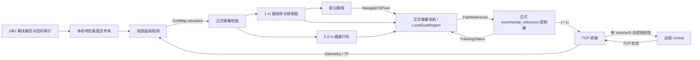

> 当前联调使用 `unreal-start-500m-ros`（500 m 地图、300 m 任务区）；启动与加载优化见本文末尾“500 m 地图与已知地图加载优化”。旧 1 km 示例保留作历史和大地图用法。

# OBJ 地形与 TCP 数字仿真

本机运行虚拟观测、正式增量地图、前沿探索、导航规划和控制；远端 Unreal 运行车辆物理仿真。网络接口以本次提供的 `UE/COMStructType.h`、`ControlComponent.cpp`、`TCPComponent.cpp` 为准，`main.py` 辅助说明端口与外层封包；此前 C# 客户端不再作为当前协议依据。当前实现位于 `feat/obj-tcp-simulation`，未自动合并、发布到 Orin 部署分支。

## 数据链与职责



新增 `lunar_obj_tcp_sim` 包包含一个离线转换工具、两个常驻节点。`operator` 只在退出时临时建立 ROS 客户端，取消任务并等待停稳。它和虚拟传感器均不发布速度；正式控制器是 `/lunar_sim/cmd_vel` 的唯一发布者，TCP 桥仅订阅并封包。

本次正式模块只调整调试话题前缀检查：允许合法的 ROS 绝对话题前缀，不再限定 `/planning_demo/`、`/lunar_demo/`。未复制或修改规划算法。所有输入和控制话题默认隔离在 `/lunar_sim`，ROS 域默认 74；不要与实车控制话题重映射到一起。

## 1. 构建

在功能工作树根目录执行，依赖需事先安装；脚本不自动联网下载依赖。

```bash
cd /home/kai/WS/lunar-navigation/lunar-runtime/.worktrees/obj-tcp-simulation
LUNAR_ROS_DISTRO=jazzy bash scripts/simulation/build.sh
```

构建、安装、日志默认位于 `~/.cache/lunar_obj_tcp_sim/jazzy/`。Humble 主机改为 `LUNAR_ROS_DISTRO=humble`，使用独立目录；本次未验证 Humble/Orin。自定义构建目录用 `LUNAR_OBJ_TCP_SIM_BUILD_BASE`；启动时对应设置 `LUNAR_OBJ_TCP_SIM_OVERLAY=<该目录>/install`。

## 2. 准备地图

已处理本机原始 OBJ，输出文件夹：

```text
/home/kai/WS/lunar-navigation/simulation-maps/open-scene-1km
```

该样例以 `(1214, -1110) m` 为中心裁剪，中心来自源模型车辆附近的几何分析，不是远端实测位姿。使用 `x,-z,y`、比例 `0.01` 的 OBJ 导出轴假设。地图元数据明确记录 `NOT_EXTERNALLY_ALIGNED`，尚不能证明与当前 Unreal 场景重合。首次接远端应核对车辆位置、朝向和邻近地形，调整 **OBJ** 的比例/轴/平移后重建；反馈按当前 C++ 发送代码处理。

将同一物理区域重建为新 ROS 坐标示例（中心 Y 同步翻转）：

```bash
bash scripts/simulation/prepare_obj_map.sh \
  --obj /home/kai/WS/lunar-navigation/ue_land/5555/OpenScene.OBJ \
  --output /home/kai/WS/lunar-navigation/simulation-maps/open-scene-new \
  --center-x 1214 --center-y 1110 --size 1000 --resolution 0.2 --halo 12 \
  --preset obj-y-up-ros-hypothesis \
  --exclude-file ros2_ws/src/lunar_obj_tcp_sim/config/open_scene_5555_excludes.json
```

输出目录应为新目录。`--auto-center --host <仿真端IP> --port 6668` 可替代两个中心参数，读取首个状态包确定中心；工具不发送运动命令。仅中心自动化，不能自动校准 OBJ 与反馈坐标。

转换仅保留任务区及观测外圈相交的三角形，生成高程、采样点与遮挡查询索引。当前工具要求三角面，遇到多边形面会要求先三角化。源文件包含车辆网格，附带的 269 个排除组只适用于这份 `5555/OpenScene.OBJ`；其他地形自行提供 `--include` / `--exclude` / `--exclude-file`。不按任意名称猜测并删除地形。

## 3. 启动导航或探索

将下面 `192.168.1.100` 换成仿真端实际 IP。端口默认 `6668`，可随时通过 `--port` 改为服务端端口。

先运行已知地图导航，便于核对坐标、速度方向和控制闭环：

```bash
LUNAR_ROS_DISTRO=jazzy bash scripts/simulation/run_obj_tcp_sim.sh \
  --host 192.168.1.100 --port 6668 \
  --map /home/kai/WS/lunar-navigation/simulation-maps/open-scene-1km \
  --mode nav --rviz --local-rviz
```

`nav` 会分块导入完整已知地形，等待地图实际接收和派生后继续下一块。1 km 地图加载需要时间；状态为 `KNOWN_MAP_READY` 后，在 RViz 使用 **2D Goal Pose** 选择目标和朝向，目标桥接为正式 `NavigateToPose` 请求。目标应在已知细图自由区域；粗指导不代替细图可达认证。

探索运行：

```bash
LUNAR_ROS_DISTRO=jazzy bash scripts/simulation/run_obj_tcp_sim.sh \
  --host 192.168.1.100 --port 6668 \
  --map /home/kai/WS/lunar-navigation/simulation-maps/open-scene-1km \
  --mode explore --rviz --local-rviz
```

`explore` 只发布视野内可见地形。默认先由正式导航控制器执行分阶段原地环视，再启动地图中心 300 m × 300 m 范围的前沿探索任务。探索运行时不启用手动目标桥，避免两个目标来源争用导航；需要手动选点时使用 `nav` 模式。无显示环境用 `--no-rviz`，同时关闭两个窗口。`--dry-run` 可检查最终配置与命令，不连接仿真端。

地图真值预览默认关闭；启用后只用于对照，不改变算法已知状态。RViz 全局窗口显示粗探索图、路线、前沿和任务范围；局部窗口显示细通行性、真实观测、局部目标/路径、平台、传感器视野、局部窗口及轨迹。HUD 显示观测覆盖、阶段、控制指令和反馈速度。

## 4. 修改参数与观测语义

复制 `ros2_ws/src/lunar_obj_tcp_sim/config/simulation.yaml`，通过 `--config /路径/simulation.yaml` 启动。CLI 显式参数覆盖文件，未指定的参数沿用文件。平台几何和能力文件通过 `--platform-config` 选择，默认使用正式 `wheel.yaml`。

| 参数 | 默认值与含义 |
| --- | --- |
| vehicle_id | 0，对应 UE 车辆 ID |
| host / port | 127.0.0.1 / 6668；实际连接需修改 host |
| sensor_range_m / sensor_fov_deg | 12 m / 120° |
| sensor_offset_xyz_m | [0.591, 0, 1.0]，车头上方，随反馈姿态旋转 |
| near_field_radius_m | 2.1 m 近场全向采样，仍检查遮挡，不强制清空自由区 |
| observation_window_m / observation_rate_hz | 28 m / 5 Hz；需覆盖传感器范围与偏移 |
| 地图细分辨率 | 来自转换地图元数据，默认转换 0.2 m |
| coarse_resolution_m / local_window_size_m | 1 m / 64 m |
| max_linear_mps / max_angular_radps | 双向 0.2 m/s / 0.5 rad/s，受正式平台能力约束 |
| command_timeout_s / feedback_timeout_s | 0.5 s / 0.5 s |
| bridge_send_rate_hz / max_wheel_speed_radps | 20 Hz / 10 rad/s；限幅会报告，不静默掩盖 |
| exploration_size_m | 300 m；任务正方形边长，以地图中心为中心，不裁剪 1 km 地形 |
| navigation_map_wait_timeout_s | 30 s |
| initial_scan / auto_start | true / true |

参数通过重启生效，不承诺运行中动态修改。正式控制器仍检查速度与平台能力的相容性，修改限速时需同步有效平台配置。

虚拟观测查询 OBJ 三角面遮挡：被岩石/脊线遮挡的后方保持未知，可见障碍表面发布真实高程，由正式地图判断不可通行。不是 Unreal 相机或激光插件，也不会通过 TCP 传输观测数据。不同于简单 demo 的程序地形生成器，这里使用源 OBJ 的空间索引；观测语义一致。

离线高程是单层上表面表示，适合露天地形；不支持桥下通行、洞穴等多层空间的完整导航语义。记录中的 `observation_coverage` 是任务区实际获得有限高程样本的比例，与正式探索器的粗图 `coverage_ratio` 不同，不能互相冒充。

## 5. TCP 与停止

当前小端线格式：

| 方向 | 外层 TCP 包头 | Payload | 总长度 |
| --- | --- | --- | --- |
| 本机 → UE | Magic、Command=3、PayloadSize=41、XOR Checksum | uint32 VehicleID + 37 字节 FDynamicsControlData | 57 字节 |
| UE → 本机 | Magic、Command=4、PayloadSize=92、XOR Checksum | uint32 VehicleID + 88 字节 FDynamicFeedbackData | 108 字节 |

默认 `vehicle_id: 0`，必须与 UE 车辆一致；在 simulation.yaml 中可修改。本机只使用对应 ID 的有效反馈，其他车辆不会更新当前定位/新鲜度。离线 `--auto-center` 同样支持 `--vehicle-id`（默认 0）。本地 RViz 模拟端同步使用这套协议。

位置单位按实际发送代码确定：`ControlComponent.cpp` 已对 UE Actor 位置乘以 0.01，因此包内位置已经是米，本机直接使用，不再除以 100；头文件 `位置(cm)` 注释与当前发送实现不一致。四元数 XYZW 在桥接入口转换为 ROS 车体姿态；世界位置翻转 Y，当前全部 ROS 车体线速度和角速度由转换后的接收位姿差分估计，未将未知速度轴强行套用 Actor 轴。无时间戳扩展。之前 53 字节控制/88 字节裸反馈的 C# 版本不再自动兼容，避免错位解析或缩小位置 100 倍。

参考 `TCPComponent.cpp` 的接收函数每次只取一个完整包，未保存不足一个包的剩余字节；真实网络拆包/粘包时可能丢指令。本机接收端已经做缓存解析，但不能代替 UE 接收端的处理。参考文件保持原样，远端该项尚未通过网络实测。

正式路径跟踪器输出车体 `v, ω`；TCP 桥接依据 `wheel.yaml` 的轮径、轮距、轴距转换为四个独立轮速与四个转角，按配置映射到 Unreal 数组。反馈的本机接收时刻只在**新反馈**到达时赋给 Odometry/TF，不重复把旧状态刷新成新状态。状态 QoS 使用 Reliable/Volatile，兼容现有探索 Reliable 和导航/控制 BestEffort 订阅端。

在启动终端按一次 **Ctrl+C**：操作脚本先取消探索/导航、等待终态与新鲜停稳反馈，再由 launch 统一结束节点；退出 TCP 前发送零命令。超过等待期限会明确提示未确认停稳，不能当作远端车辆已停的证据。链路断开时本机无法保证远端执行最后零命令；远端物理车辆的失联处理仍由仿真端承担。TCP 不自动重连复用旧运动意图，重新启动建立新会话。

常见检查（另开已 source 同一 overlay 的终端，`export ROS_DOMAIN_ID=74`）：

```bash
ros2 topic echo /lunar_sim/observation_status
ros2 topic echo /lunar_sim/odometry --once
ros2 topic echo /lunar_sim/tracking_status --once
ros2 topic echo /lunar_sim/planning/diagnostics --once
```

反馈停止更新先检查网络和仿真服务端；地形对不上先核对 OBJ metadata 与坐标；不能因为真值预览覆盖未知区域就判定已经观测。验证范围、失败记录与运行证据见 [验证记录](OBJ_TCP数字仿真验证记录.md)。

## 本机 RViz 一键测试（无需 Unreal）

先完成前面的构建，然后在工作树根目录运行：

```bash
# 默认现有 1 km OBJ 地图，探索中心 300 m × 300 m，两个 RViz 窗口。
bash scripts/simulation/run_local_rviz_demo.sh

# 已知地图导航，地图加载完成后使用 RViz 的 2D Goal Pose。
bash scripts/simulation/run_local_rviz_demo.sh --mode nav
```

本地入口自动启动只监听 `127.0.0.1` 的 TCP 车辆，选择空闲端口并传给原有正式栈入口。默认地图为本机已经转换的 `simulation-maps/open-scene-1km`；在其他机器需用 `--map /你的地图目录`。`--port` 可指定本地端口；不接受远端 host，远端仿真仍使用 `run_obj_tcp_sim.sh`。

车辆初始位置默认任务矩形中心，Z 从 OBJ 高程读取；可用 `--start-x <米> --start-y <米> --yaw <弧度>` 调整。车轮几何读取同一 `wheel.yaml`，也支持 `--platform-config`。`--config` 传递正式仿真配置，`--no-rviz` 关闭两个窗口，`--domain-id` 默认 74。

本地车辆提供四轮转向运动学、加减速、有限转向速度（1.5 rad/s）、位置高程跟随、20 Hz 状态反馈与命令超时制动。速度和转角反馈采用当前 C++ 字段约定。它没有独立的车体碰撞求解、悬架、轮地接触或完整坡面姿态模型；路径避障由正式规划器承担。本地通过不能替代 Unreal 物理验证。

1 km 已知地图导入会逐块等待正式派生，`nav` 初始等待明显长于局部观察；默认 `explore` 按视野逐步揭示。仿真保持 **1×、0.2 m/s**，未添加旧 demo 的 30× 时钟。完整大地图探索耗时很长，先在车辆附近观察地图和路径行为。

终端按一次 **Ctrl+C** 退出。本地服务端会保持运行，直到正式栈完成取消和停稳退出，然后关闭反馈连接。单独关闭 RViz 窗口只关闭显示，不等于取消任务；停止任务请使用启动终端。

探索范围与地图范围独立：默认任务中心为地图任务区域的中心，当前示例为 `(1214,-1110) m`，300 m 边界为 X `[1064,1364]`、Y `[-1260,-960]`。任务边界显示、START 消息和观测覆盖率使用同一边界；传感器仍可观测边界之外，导航已知地图仍使用完整 1 km 地形。更改 `exploration_size_m` 后重启任务生效。小于指定边长的测试地图按实际地图范围取交集。

任务范围显示使用粗紫红色边框和边长标注。全局窗口启动时按任务范围自动居中、缩放并固定在 map；局部窗口仍跟随车辆。紫红色框表示探索任务边界，绿色扇形表示传感器视场，两者含义不同。


## 坐标修正后的 Unreal 启动（2026-09-11）

确认的来源定义：世界左手系、Z 向上；VehicleActor 左手系，X 后、Y 下、Z 左；四元数是该 Actor 相对于世界的姿态。ROS map 保持世界 X/Z，翻转 Y；base_link 为 X 前、Y 左、Z 上。姿态使用两端基变换 `R_ros = W R_wire B.T`，不能直接照抄四元数或只修正传感器偏移。B 将 Actor 向量换成 ROS `(-x,z,-y)`。不另设“旋转坐标系”。线速度和角速度字段的轴独立核对，不能从 Actor 轴直接推定。

虚拟传感器使用 ROS 车体安装偏移 `[0.591,0,1.0]`，随正确车体姿态计算。
TCP 字节布局、VehicleID=0、端口 6668 和本机接收时间戳不变。

本次从源 OBJ 重建的新地图为 `/home/kai/WS/lunar-navigation/simulation-maps/unreal-start-1km-ros`，使用 `x,z,y`、0.01 比例，中心为 ROS `(3163.6262,46.0188)`。旧 `unreal-start-1km` 的 Y 方向与新桥接不一致，联调请切换新目录。`open-scene-1km` 仍可用于本机自洽模拟，但不能据此证明 Unreal 配准。

新预设 `obj-y-up-ros-hypothesis` 输出 ROS 坐标；显式 `--axes`、`--offset` 和 `--center-x/y` 均描述最终 ROS 地图，`--auto-center` 会先转换反馈位置。旧预设只为重现历史数据保留。OBJ 导出轴仍属于待实景配准的假设，不因坐标换算测试通过而宣称配准完成。

先在当前联调终端 Ctrl+C，等待正常退出。然后：

```bash
cd /home/kai/WS/lunar-navigation/lunar-runtime/.worktrees/obj-tcp-simulation
export LUNAR_ROS_DISTRO=jazzy
bash scripts/simulation/build.sh
bash scripts/simulation/run_obj_tcp_sim.sh \
  --host 192.168.10.23 --port 6668 \
  --map /home/kai/WS/lunar-navigation/simulation-maps/unreal-start-1km-ros \
  --mode nav --rviz --local-rviz
```

`nav` 会加载已知地图，观测计数为零不代表扫描失效。要检验未知区域逐步揭示，将模式改成 `--mode explore`；该模式会自动执行初始扫描和探索任务，默认任务区仍为 300 m × 300 m。


## 转向实测与最终 Actor 轴修正（2026-09-11，覆盖之前的轴假设）

已按用户确认的 VehicleActor 局部轴 **后 X、下 Y、左 Z** 完成姿态转换。ROS 位置为 `(X,-Y,Z)`，姿态 `R_ros=W R_actor B.T`，`B=[[-1,0,0],[0,0,1],[0,-1,0]]`。传感器安装偏移为 ROS `[0.591,0,1.0]`。世界系没有改变，继续使用 `unreal-start-1km-ros`，无需再转换地图。

实测先发现控制校验错误：接收端 `UTCPComponent::ValidateControlData` 只累加 8 个浮点数字段的 uint32 位模式，**不包含 Head**。原编码和本机模拟器都误加了 Head，本机闭环因此没有发现此问题。现已修正编码、两个模拟接收端及独立字节级回归测试；零速度指令末尾校验字节为 0。

修复后，对 VehicleID=0、192.168.10.23:6668 进行了两段 ±0.1 rad/s、各 3 秒的原地转向指令。实际左转约 8.2°、右转约 9.2°，原始 AngularVelocity.Y 的符号与 ROS 正负转向一致。反馈数值不是可直接照用的 rad/s：姿态积分/原始 Y 积分约为 0.0209，不能将拟合值直接写死为单位倍率；用户没有设置已知时间倍率。[公开 Vortex 传感器文档](https://docs.vortexsim.com/2026.3/user-guides/mechanical-engineer-guide/vortex-sensors/)描述了度/秒输出，但没有提供当前 UVSPRigidBodyComponent 的实现，不能据此证明此接口单位。

当前处理：`linear.xyz` 和 `angular.xyz` 均使用本机接收时刻与相邻 ROS 位姿差分，再表达在当前 base_link 坐标系；原始 LinearVelocity.X 曾在现场出现与实际前进相反的符号，已停止将其用作 ROS 前向速度。启动日志明确提示这个临时来源。首帧、断档或异常时间间隔不形成有效差分，相关 covariance 置大。该估计受网络批量到达和抖动影响；尚未完成原始角速度单位与其余速度轴的全量标定，不作为生产速度传感器的验证结论。**没有把原始 Y 直接当 rad/s，也没有拟合一个倍率来掩盖差异。**

可重复运行已保存的测试工具（先退出导航 TCP 客户端，确保只有一个指令来源）：

```bash
bash scripts/simulation/test_turn_feedback.sh \
  --host 192.168.10.23 --port 6668 --vehicle-id 0 \
  --output /tmp/unreal-turn-check-01
```

该命令会实际发送短时转向指令，按静止、正转、停稳、反转、停稳顺序执行，结束发送零速；写入 `turn-feedback.json`，已有记录不覆盖。丢反馈或平移超出 0.3 m 时终止。没有实际转动不会报告测试通过。正式导航使用说明中的原启动脚本、新 `-ros` 地图和 nav 模式；探索模式会自动启动探索，不用于这项转向标定。


## 500 m 地图与已知地图加载优化

当前联调改用 `/home/kai/WS/lunar-navigation/simulation-maps/unreal-start-500m-ros`，任务范围仍为 300 m × 300 m，细格仍为 0.2 m。该目录从已有 1 km 数据直接裁剪，保留原始格点和三角形遮挡信息，没有重采样；原 1 km 目录保留。

已知地图 nav 加载从首个有效车辆位置附近开始，每块默认 512 × 512 细格（102.4 m × 102.4 m），车辆位于首块中部。随后由近到远分块加载，每格只覆盖一次；仍等待正式地图接收和派生完成，避免连续发送覆盖未处理输入。nav 不再把每块所有细格生成黄色观测点，正式细地图和全局地图继续显示；explore 的真实虚拟观测及黄色观测点不变。

`simulation.known_chunk_cells` 可调块大小，默认 512。构建脚本默认使用 CMake Release；原缓存没有 CMAKE_BUILD_TYPE，地图计算未启用优化。需要调试构建时可设置 `LUNAR_CMAKE_BUILD_TYPE=Debug`，不限制合法配置。

```bash
cd /home/kai/WS/lunar-navigation/lunar-runtime/.worktrees/obj-tcp-simulation
export LUNAR_ROS_DISTRO=jazzy
bash scripts/simulation/build.sh
bash scripts/simulation/run_obj_tcp_sim.sh \
  --host 192.168.10.23 --port 6668 \
  --map /home/kai/WS/lunar-navigation/simulation-maps/unreal-start-500m-ros \
  --mode nav --rviz --local-rviz
```

车辆附近地图先可用不代表整张地图加载完成；整图完成状态仍为 `KNOWN_MAP_READY`，日志记录块数和派生完成耗时。请以已加载区域选择导航目标。

需要从已处理地图重新裁剪时，使用新输出目录：

```bash
PYTHONPATH=ros2_ws/src/lunar_obj_tcp_sim python3 -m lunar_obj_tcp_sim.crop_map \
  --source /home/kai/WS/lunar-navigation/simulation-maps/unreal-start-1km-ros \
  --output /home/kai/WS/lunar-navigation/simulation-maps/unreal-crop-500m \
  --size 500
```

默认中心沿用源地图，`--center X Y` 可指定 ROS 世界坐标中心；裁剪范围及 12 m 观测外圈必须在源数据内。只改变地图裁剪尺寸不会改变 `exploration_size_m`。

本机 Jazzy + 当前 Unreal 联调实测：首个车辆细格可用约 **2.25 秒**，500 m 整图加载完成约 **167 秒**（49 块，含双 RViz 启动及交互导航）。首块先可用与整图完成是两个独立指标；当前 1 km 完整加载尚未重新计时。

### 车头上方传感器安装位置

按用户指定的车头上方 1 m，虚拟安装点设为 ROS 车体系 `[0.591, 0, 1.0]`，对应 VehicleActor `[-0.591, -1.0, 0]`，视场朝 ROS +X（Actor −X）。前向 0.591 m 取自 `config/wheel.yaml` 的车体轮廓前缘，假定 Actor 原点与项目车体中心一致；高度 1 m 以该原点平面为基准，不是离地高度，也没有额外叠加车身高度。若实际 Actor 原点或车头位置不同，应调整 `simulation.yaml` 的 `sensor_offset_xyz_m`。安装点参与射线观测和 RViz 显示，随反馈姿态一起旋转。此配置变更需重启节点生效，不代表启动盲区问题已经通过联调验证。

### 四轮独立转向与驱动

链路：正式 PathExecutor 跟踪路径 → `cmd_vel` 的 `linear.x/angular.z` → `FourWheelSteering` → TCP `WheelSpeed[4] + TurnAngle[4]`。路径规划与跟踪器保持车体速度接口；不再使用左右轮差速分配。当前任务仍为前后行驶和转向，没有增加横移路径规划。

轮位在 ROS 车体系中取轴距、轮距的一半；对轮位 `(x_i,y_i)`，目标平面速度为 `(v-ω*y_i, ω*x_i)`。轮向与这个向量平行，轮速由向量长度除以轮半径得到。允许反向滚动，将轮向保持在 ±90° 内。原地转向时四轮沿绕车体中心的切线排列；本项目尺寸对应转角绝对值约 50.66°，不是转角为零的滑移转向。轮速超限时四轮统一缩放，保留目标曲率。

以下参数在 `simulation.yaml` 设置，用 `--config /路径/simulation.yaml` 启动，重启生效：

| 参数 | 含义 |
|---|---|
| `wheel_order` | 每个 `WheelSpeed` 数组槽对应的标准轮编号，默认 `[0,1,2,3]` |
| `steering_order` | 每个 `TurnAngle` 数组槽对应的标准轮编号，默认 `[0,1,2,3]` |
| `wheel_signs` | 四个轮速槽的正负方向，默认全 `1.0` |
| `steering_signs` | 四个转角槽的正负方向，默认全 `-1.0`；Unreal 正转角向右 |
| `steering_zero_rad` | 四个转角槽朝前时的接口读数，默认全 `0.0` |
| `max_steering_angle_rad` | 相对朝前零点的允许转角绝对值，默认 π/2；应按实际关节能力设置 |
| `steering_tolerance_rad` | 实际反馈与目标转角的允许差，默认 0.1 rad，约 5.73° |

标准编号：0 左前、1 右前、2 左后、3 右后。例如 Unreal `Wheels` 数组为右前、右后、左前、左后，则 `wheel_order: [1,3,0,2]`；`Turns` 数组独立核对。转角正向指 ROS 俯视向左，单位 rad。参考 C++ 已实现 rad→deg 控制、deg→rad 转角反馈，协议格式、6668 端口和 VehicleID=0 不变。

没有有效转角反馈或轮向未到位时，桥接继续发送目标转角，轮速为零；反馈到位后由后续 `cmd_vel` 更新释放轮速。零速度、命令超时和退出停止驱动并保持最后目标转角。超出配置转角范围的命令明确报错并停止驱动，不截断转角来伪造可行运动。

2026-09-11 已通过逐通道实测和用户画面观察确认 Turns 顺序为左前、右前、左后、右后，正接口角向右，因此 steering_signs 全为 -1。四轮同向轮速实测确认正值前进、负值后退；修正后的正/负原地转向分别得到左转/右转。WheelSpeed 数组的前后轮槽未逐轮目视区分（当前 v/ω 模型中同侧前后轮速相同），保留 wheel_order 可配置。当前零点为测试起始朝前位置，实际关节极限未标定；±90° 仍是配置值。转向测试脚本同样已改为四轮转向，可通过 `--config` 使用同一份标定配置；不要与导航客户端同时连接。

### 起步近场覆盖与扫描失败后的持续观测

默认近场半径为 2.1 m，以实际虚拟传感器安装点为中心；保持原三角网格射线遮挡检测，不把车体附近强制标成 FREE。该值用于当前车头上方安装配置，不能保证所有姿态、地形或遮挡下均能起步。

初始扫描失败进入 BOOTSTRAP_FAILED 后，继续接收新位姿、计算虚拟观测并发布高程地图；相同旧时间戳不重复采样。暂停的仅是初始扫描与探索任务推进，不自动跳过失败的扫描角度，也不在相同输入下反复重发导航。若存在未结束的超时扫描，沿用原取消机制。自动依据新证据重试属于后续功能，本次未增加；需要再次启动时重启仿真栈。

### 低速分段初始扫描与滑移后重新定点

初始扫描默认采用 0.15 rad/s 角速度上限、0.1 rad/s² 角加速度上限，每段 30°。每段均通过正式 NavigateToPose 规划，目标位置取发送时的实际位姿。完成一段后，下一段使用新的实际位置，不要求回到最初启动点。

扫描中相对本段起点位移超过 0.1 m 时，取消旧 Action；等待旧 Action 返回终态，且新鲜速度反馈和控制命令确认停稳持续 0.3 s，再从实际位置重新申请同一目标朝向。新起点及路径由正式规划器认证；无法规划时保持失败暂停并继续观测。重新定点不重置本段 45 s 超时，也不把未完成的朝向计入扫描完成。

| 配置项 | 默认值 | 作用 |
|---|---|---|
| scan_max_angular_radps | 0.15 | 初始扫描角速度上限 |
| scan_max_angular_accel_radps2 | 0.1 | 初始扫描角加速度上限 |
| scan_step_deg | 30.0 | 分段角度，支持 5～90° |
| scan_reanchor_distance_m | 0.1 | 本段滑移后取消并重新定点的距离 |
| bootstrap_timeout_s | 45.0 | 每个目标朝向的总时间，包含重新定点和停稳等待 |

这些配置在 simulation.yaml 中修改，重启生效。角速度/角加速度还受正式平台能力上限限制。scan_controller.py 是 OBJ 仿真包内的薄适配入口，继承正式控制节点，使用同一个 PathExecutor 和唯一的 cmd_vel 发布者；扫描时切换低速策略，扫描完成后恢复正常策略。没有复制跟踪算法、没有新增第二路速度发布者、没有放宽普通导航的位置容差。控制参数限制的是执行器输出策略，不等于已标定 Unreal 物理响应的角速度尺度。

scan_sequence.py 单独管理扫描 Action 和重新定点时序；sensor_node.py 继续负责观测。RViz 状态增加剩余扫描段数和重新定点次数。若正式规划失败或本段超时，仍保持 BOOTSTRAP_FAILED，不自动无限重试。

正式 PathExecutor 的转向加减速限制以最近实际发布的角速度指令为起点，停稳判断仍使用实际位姿/速度反馈。这样即使仿真车辆响应快于指令，也能逐步降低命令，而不会因测得角速度高于上限而一直卡在最大转速。节点因输入失效等原因发布零指令时同步更新该记录。此修复属于通用控制执行逻辑，扫描专用上限仍仅在初始扫描期间使用。

### 当前联调任务范围：120 m × 120 m

当前 simulation.yaml 的 exploration_size_m=120.0。继续使用 unreal-start-500m-ros 数据，以原地图任务区域中心裁出 120 m × 120 m 探索区域；不重新处理 OBJ。启动时显式传入 --config ros2_ws/src/lunar_obj_tcp_sim/config/simulation.yaml 可确保读取工作树中的配置。初始低速扫描参数保持不变。

### 行进顿挫处理

ROS 车体线速度使用约 0.2 s 的接收位移窗口（保留窗口边界样本），降低 TCP 帧集中到达造成的速度尖峰；角速度仍使用相邻姿态差分。窗口会增加短暂的速度估计滞后，停止时需真实反馈收敛，不会以命令零速代替实际停稳。正式 PathExecutor 行进和旋转指令均以最近输出做加减速限制，跟踪几何、停稳、输入失效和制动判断仍使用实际状态。此改动不增加远端时间戳，也不代表网络时钟或物理速度已标定。

### 当前默认观测与转向配置

虚拟观测半径 30 m，水平视场 360°，观测窗口 64 m，保留 OBJ 射线遮挡与 0.2 m 采样。探索任务仍为 120 m × 120 m、地图仍为 500 m。由于全向观测无需转圈补盲，initial_scan=false。普通导航 max_angular_radps=0.15、max_angular_accel_radps2=0.1，线速度上限仍为 0.2 m/s；控制器同时受平台能力上限约束。这些是 OBJ 仿真配置，重启生效，不修改公共 wheel.yaml。需要启动扫描可将 initial_scan 改回 true，其独立低速参数继续有效。

### 候选点附近反复转向处理

2026-09-12 恢复终点朝向要求：探索器无论采用全向还是窄视场传感器，均发送 has_target_yaw=true，要求满足候选目标的终点朝向。探索器提交目标位姿，导航器负责路径规划和导航任务结果，控制器执行路径及终点对准；沿用现有 Action、PathReference 和 TrackingStatus。

按用户选择，OBJ 仿真采用以下待验证容差，launch 将同一份配置分别传给导航器和控制器：

| simulation.yaml 参数 | 当前值 | 含义 |
|---|---|---|
| goal_position_tolerance_m | 0.10 | 终点平面位置误差，单位 m |
| goal_yaw_tolerance_rad | 0.05 | 终点航向误差，约 2.86° |

导航节点支持这两个启动参数；未覆盖时仍采用原公共平台默认值。现有导航器的有效位置容差为 max(配置值, 细栅格分辨率的一半)，因此当前 0.20 m 细栅格下，仅调参数最低有效值为 0.10 m。继续降低配置不能让导航器按更小的位置误差判定成功，还会与控制器标准不一致。航向没有同样的栅格下限，但 0.05 rad 也只是本轮试验值，不是已测出的坡面精度极限。

控制器沿用现有停稳门槛，同时检查前向和横向合速度 hypot(vx, vy)，避免横向滑动被当作停稳。TCP 桥在首帧或接收断档等无法差分估速时发布 NaN 速度并保留大 covariance，位姿继续有效；控制器按已有无效输入逻辑停车等待，不能把“暂时不知道速度”当作“已经静止”。有效速度恢复后沿用正常执行流程。角速度仍采用相邻姿态差分，本次不增加滤波器、重试状态机或跨模块机制。

30 m/360° 观测、行进和低速转向限速保持原值。需要重新构建相关包并重启节点后生效；源码和本机回环测试不能证明 Unreal 坡面上已消除滑移或反复微调。不能仅靠缩小容差保证实际停车精度。
