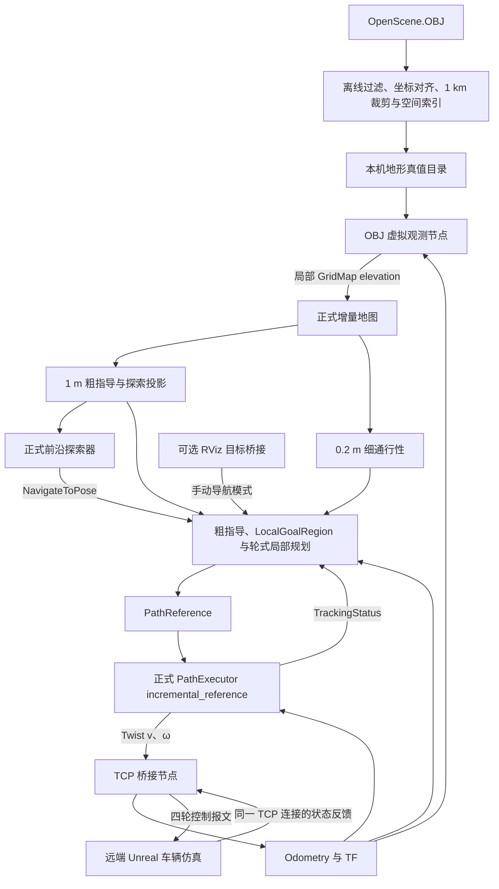

> 2026-09-11 四轮转向修订：本文件的早期 C# 差速假设已被 C++ 参考接口和用户确认的四轮独立转向平台取代。当前实现为 `kinematics.FourWheelSteering`，四轮转角参与执行；轮序和关节标定可配置，以《OBJ_TCP数字仿真使用说明》的“四轮独立转向与驱动”为准。以下旧方案保留用于说明设计演变，不用于指导当前控制配置。

> 2026-09-11 联调更正：本文历史 C#／不换轴约定已被实际 C++ 接收协议与 Actor 轴确认覆盖。控制校验不含 Head；Actor 为后 X、下 Y、左 Z；世界 Y 翻转；原始角速度 Y 正值为 ROS 左转，但单位尚未闭合，当前使用接收姿态差分。以 [当前使用说明](../../OBJ_TCP数字仿真使用说明.md) 与 [验证记录](../../OBJ_TCP数字仿真验证记录.md) 为准。

# 1 km OBJ 地形与 TCP 数字仿真方案定稿

日期：2026-09-11。

后续协议修订：用户指定新 C++ 参考组取代 C#；当前为带 VehicleID=0 的 57 字节控制 / 108 字节反馈，位置按发送实现直接为米。下文初版协议表仅为历史设计，现行实现以 [使用说明](../../OBJ_TCP数字仿真使用说明.md) 为准。
状态：本机功能已实现，验证状态见 [验证记录](../../OBJ_TCP数字仿真验证记录.md)。远端 Unreal 尚待联调。

开发基线：`integration/pure-planner-orin`；本方案位于独立分支 `feat/obj-tcp-simulation`。本文保留设计范围；实际接口、操作和限制以 [使用说明](../../OBJ_TCP数字仿真使用说明.md) 为准。

## 1. 已确定的范围与依据

本机运行地图处理、虚拟观测、探索、导航和控制；另一台设备运行 Unreal 车辆物理仿真，通过 TCP 接收控制、返回实时状态。规划和探索使用平台初始位置附近 **1 km × 1 km** 的固定任务区域。

接口以用户最新提供的 [LunarCarClient(3).cs](</home/kai/WS/lunar-navigation/UE/LunarCarClient(3).cs>) 为准。旧的 `COMStructType.h`、`ControlComponent.cpp`、`TCPComponent.cpp`、`main.py` 以及历史 TCP 分支只作为背景，冲突的字段、封包长度、端口和坐标处理不再沿用。

本次反馈处理完全按照 C# 客户端：**位置除以 100；四元数、线速度、角速度的分量直接使用**。不再增加“世界速度还是车体速度”的对接前置问题，也不自行附加换轴、取反或速度旋转。

| 项目 | 定稿选择 |
| --- | --- |
| TCP 角色 | 本机为客户端，连接远端仿真服务端；同一个连接收发 |
| 网络配置 | 端口默认 `6668`；IP、端口通过配置和启动参数修改 |
| 协议 | 保持 C# 字段及校验；无时间戳、序列号、VehicleID 或协议版本扩展 |
| 时间 | 本机接收时间作为 ROS 时间戳；`use_sim_time=false`，首版按 1× 运行 |
| 平台 | 使用项目 `config/wheel.yaml`，支持前进、后退、圆弧和原地转向 |
| 默认速度 | 前进、后退均为 `0.2 m/s`；控制器默认角速度上限 `0.5 rad/s` |
| 地图 | 0.2 m 高程和细通行性，1 m 全局粗指导与探索投影 |
| 软件增量 | 一个离线 OBJ 工具、两个常驻 ROS 节点、配置与启动/使用文档 |

不扩展 UE 网络协议，不增加相机/激光数据通道、SLAM、DRL、返航或 KnownSpaceRoutePlanner。旧 RViz demo 的本地车辆积分器和 30× 仿真时钟不接入这条 TCP 链路。

## 2. 系统架构与职责



- **离线工具**只处理几何、坐标、裁剪和查询索引，不判定机器人可通行性。
- **虚拟观测节点**根据真实反馈位姿查询 OBJ，发布可见高程，不生成导航路径、不模拟车辆运动。
- **正式地图模块**使用 `PersistentElevationMap` 累计观测，由 `FineTraversabilityBuilder` 按平台能力派生细通行性，再生成全局粗指导及探索投影。
- **探索器**选择前沿观测目标，通过 `NavigateToPose` 请求导航。沿用集成基线中的候选记忆和默认 30 秒缺地图等待处理。
- **导航器**保留现有全局粗指导、`LocalGoalRegion` 和轮式局部搜索，发布可执行 `PathReference`。
- **控制器**根据路径和反馈状态产生唯一的 `Twist`；启用 `incremental_reference`，通过 `TrackingStatus` 回报当前 session/段的执行与停稳状态。
- **TCP 桥接器**负责封包、拆包、单位处理、ROS 状态输出及车体速度到轮速的换算，不选择目标或决定路径。

## 3. TCP 报文与反馈处理

### 3.1 控制发送

采用 C# 的紧凑布局，首版显式按小端编码，不依赖本机结构体填充。

| 部分 | 字段 | 大小/规则 |
| --- | --- | --- |
| 外层头 | `Magic, Command, PayloadSize, Checksum` | 4 个 uint32，共 16 字节 |
| 外层取值 | `0x4C494441, 3, 37, Magic XOR Command XOR PayloadSize` | 对应 C# `SendPacket(..., 3, payload)` |
| 控制体 | `Head`、四轮转速、四轮转角、末尾校验 | uint32 + 8 个 float32 + uint8，共 37 字节 |
| 控制体头 | `0xEB92EB92` | 与 C# 一致 |
| 控制体校验 | `Head` 加上 8 个 float 的 uint32 位模式，取低 8 位 | 包含 `Head`，不采用旧参考中的另一种求和 |
| 完整控制报文 | 外层头 + 控制体 | 53 字节，无 VehicleID |

字段顺序为 `WheelSpeed0..3, TurnAngle0..3`。轮序沿用 C#：0 左前、1 右前、2 左后、3 右后。四轮转角均为零，同侧前后轮速度一致。

### 3.2 状态接收

C# 接收端在字节流中寻找 `0xEB93EB93`，随后按下列 **88 字节反馈体**解析：

| 顺序 | 内容 | 数量 |
| --- | --- | --- |
| 1 | `Head` | 1 个 uint32 |
| 2 | 四轮转速、四轮转角 | 8 个 float32 |
| 3 | `PositionX/Y/Z` | 3 个 float32 |
| 4 | `RotationX/Y/Z/W` | 4 个 float32 |
| 5 | `LinearVelocityX/Y/Z` | 3 个 float32 |
| 6 | `AngularVelocityX/Y/Z` | 3 个 float32 |

88 字节表示反馈体长度；C# 没有解析反馈的外层封包，本文不把它推定为固定 104 或 108 字节整包。

桥接器保留 C# 的签名定位方式，补上 TCP 字节流必需的缓存：保留半包、连续处理粘包、保留末尾可能跨接收边界的签名字节。完整体不足 88 字节时等待下一次接收，不丢弃已收到的部分；积压时使用最新完整反馈作为当前状态。仅做长度、有限数值及可用姿态等基本检查，不新增线上的握手和校验字段。

### 3.3 坐标、单位和时间

```text
position_m = (PositionX, PositionY, PositionZ) / 100
orientation = (RotationX, RotationY, RotationZ, RotationW)
linear_velocity = (LinearVelocityX, LinearVelocityY, LinearVelocityZ)
angular_velocity = (AngularVelocityX, AngularVelocityY, AngularVelocityZ)
```

速度单位沿用 C# 显示的 m/s 和 rad/s；四元数顺序为 xyzw。桥接器不额外换轴、反转 yaw、缩放速度或旋转速度向量。这是本次选定的仿真接入约定；C# 本身只显示这些数据，不能据此声称已验证 ROS 与实际服务端的物理坐标一致性。

ROS 采用 `odom -> base_link` 状态；`map` 与 `odom` 使用相同数值坐标。桥接器向 `/tf` 持续发布直接的单位 `map -> odom`，并依据新反馈发布 `odom -> base_link`。任务裁剪中心只决定地图范围，不将反馈位置再次减去中心。`base_footprint` 仍是平台几何配置名称，不替换 odometry 的 child frame。

收到完整有效状态时记录本机接收时间，写入 Odometry 和对应 TF；虚拟观测使用同一状态快照及其时间戳。没有新状态时不得反复给旧数据盖新时间戳。首版无远端时钟同步或网络延迟补偿，也不发布 `/clock`。

## 4. 车体控制到 C# 四轮接口

正式控制器输出线速度 `v`（m/s）和角速度 `ω`（rad/s）。C# 在线上发送的是四轮角速度，不存在直接承载 `v、ω` 的报文字段。因此只在桥接器末端增加差速换算：

```text
r = wheel_diameter_m / 2
b = track_width_m
left  = (v - ω × b / 2) / r
right = (v + ω × b / 2) / r
WheelSpeed0..3 = [left, right, left, right]
TurnAngle0..3 = [0, 0, 0, 0]
```

轮径、轮距从同一份 [wheel.yaml](../../../config/wheel.yaml) 读取，不在桥接器另存一套平台尺寸。当前 `r=0.1595 m`、`b=0.67 m`：直行 `v=0.2, ω=0` 对应四轮约 `1.254 rad/s`；原地转向 `v=0, ω=0.5` 对应左轮约 `-1.050`、右轮约 `+1.050 rad/s`。

C# 手动界面的滑块、Lerp 和比例混控是人工输入处理，不是带轮径/轮距的 m/s、rad/s 运动学换算。这里保持其轮序、零转角和报文格式，由正式控制器承担速度、加减速和执行阶段控制，由桥接器完成上述单位适配。四轮滑移与地面作用由 UE 实际物理响应决定，须通过反馈验证直行、圆弧和原地转向。

发送跟随当前控制指令，默认 20 Hz，与正式控制器频率一致。桥接发送轮速上限默认沿用 C# 的 10 rad/s，作为独立接口参数允许调整；超出时显式记录限幅，不得以桥接器截断掩盖控制器超出平台速度上限。前后速度上限和平台能力均来自项目配置。

正常停止顺序为取消当前任务/导航、让控制器输出零速、发送零轮速后关闭连接。失去新反馈沿用控制器默认 0.5 秒超时停止；桥接器对过期命令停止重发旧的非零值。连接已经断开时无法通过 TCP 发送停车，C# 未提供服务端断连行为证据，联调记录实际响应；不预先要求增加协议或 UE 端状态机。

## 5. OBJ 预处理与地图目录

输入为 [OpenScene.OBJ](</home/kai/WS/lunar-navigation/ue_land/5555/OpenScene.OBJ>)。已有只读清点显示约 4.4 GB、1906 万顶点、3681 万三角形，包含 Landscape、岩石等静态几何，以及天空、车辆和相机等非任务对象。运行时不反复解析整个 OBJ。

离线工具完成以下流程：

1. 按对象/组过滤，保留地面及需要参与遮挡、地形约束的静态几何；排除天空、车辆自身、相机和传感器模型。输出保留/排除清单供查看。
2. 将 OBJ 导出坐标一次性对齐到第 3 节的反馈坐标。比例、轴映射和偏移写入地图元数据；这属于 OBJ 导入，不向 TCP 反馈再叠加另一套换轴。当前 OBJ 数值显示其高程轴可能与反馈不同，实际变换数值由预处理核对后记录，不将尚未验证的轴排列冒称已知。
3. 以指定中心裁剪固定 1000 m × 1000 m 任务区域。未指定中心时，启动流程从首条有效反馈取中心，再调用同一个离线工具。裁剪任务一旦建立不随车辆移动。
4. 保留任务边界外的观测缓冲区，至少覆盖传感器范围及边缘栅格；任务边界外的数据不计入任务覆盖率。按三角形与区域相交判断裁剪，避免只检查顶点而漏掉穿越边界的大三角形。
5. 三角形栅格化得到 0.2 m 高程及有效性数据，保留裁剪几何与局部射线查询索引。使用三角面插值，不把稀疏 OBJ 顶点简单投票成已知/未知格。
6. 输出一个可复制的地图文件夹，包含元数据、裁剪几何/索引、按需读取的高程数据和预览。原始 OBJ、缓存和生成地图均放在源码仓库外。

1 km × 1 km 在 0.2 m 下约有 2500 万格，单个 float32 高程层约 100 MB；这只是一个数据层的大小。预处理与真值存储采用分块/按需读取，ROS 日常只传局部窗口。现有正式地图和粗探索图的内存、更新耗时仍需实测，不能由真值分块推断整个算法栈已经具备 1 km 实时性能。

0.2 m 是表示和查询分辨率，不能补出原始三角网格没有的细节。地面、岩石和脊线参与同一套几何处理，不能仅画成预览。OBJ 是几何导出，不等于 UE 的碰撞设置；联调核对主要障碍与实际车辆接触行为。

## 6. 虚拟观测与粗细地图

复用现有复杂 demo 的输入语义与配置起点，将解析地形查询替换为裁剪 OBJ 的表面查询和具有高度的视线遮挡。无需 UE 发回点云或深度图。

| 参数 | 默认值 | 含义 |
| --- | --- | --- |
| `fine_resolution_m` | 0.2 m | 虚拟高程栅格与正式细图 |
| `coarse_resolution_m` | 1.0 m | 全局粗指导和探索投影 |
| `sensor_range_m` | 12 m | 本机虚拟观测模型的水平范围 |
| `sensor_fov_deg` | 120° | 随车辆 yaw 转动的水平视场 |
| `sensor_offset_xyz_m` | `[0, 0, 1.5]` m | 相对反馈车体位姿的虚拟观测原点偏移 |
| `near_field_radius_m` | 1.4 m | 显式的全向近场观测，与现有 demo 一致，可设 0 关闭 |
| `observation_window_m` | 28 m | 140 × 140 的局部高程发布窗口 |
| `local_window_size_m` | 64 m | 正式局部规划搜索窗口，不代表已观测范围 |
| `observation_rate_hz` | 5 Hz | 基于最新真实反馈进行局部查询的目标频率 |

上述范围、视场及近场是本机虚拟传感器的配置，C# 文件没有规定观测范围。观测原点默认放在反馈车体位姿上方 1.5 m，偏移随车体姿态变换，并在可视化中标出；这是本机模型的可调初值，不冒充 UE 中某个真实相机或雷达安装参数。观测采用原点到候选表面的几何视线，首版不另建垂直束角模型。

观测规则：

- 只有范围、视场或显式近场内，且视线实际可见的表面产生高程；其余为 `NaN`。近场同样进行遮挡查询，不能作为直接填充 FREE 的圆盘。
- 使用裁剪几何的首个表面交点处理岩石、脊线及地形自遮挡。可见障碍前缘必须留下表面证据，其后的地面继续未知，不能只采自由地面而漏掉阻挡物。
- 高程格按固定地图原点和格心对齐，不随滚动窗口改变同一物理位置的网格身份；障碍边缘和薄面采用与栅格相交的采样处理，避免格心漏采。
- 仅向正式地图输入其已支持的 `elevation`。可通行性仍由正式 FineBuilder 基于车体、坡度、起伏和净空等规则派生；不另加一个无人消费的“占据层”并声称障碍问题已经解决。
- 当前正式输入是单值高程，不能完整表达桥下空间和悬挑等多层结构。预处理报告这种几何，首版不宣称可规划穿越它；代表性岩石/脊线用地图集成测试核对派生结果。

现有 demo 的遮挡主要是平面实体栅格，本方案补足 OBJ 高度引起的遮挡；不模拟材质、光照、图像识别、测量噪声或传感器标定误差。采样高程和近场假设在记录中保留，避免将理想几何观测误写成实际传感器效果。

## 7. 两种运行模式与可视化

**导航模式 `nav`：** 将裁剪区域内有效高程分块输入同一正式地图接口，完成已知地图建图后，使用 RViz `2D Goal Pose` 选择目标，验证坐标、控制和路径跟踪。地图缺面仍然未知。该模式不启动自动探索，不用于衡量探索效率。

**探索模式 `explore`：** 正式地图从局部观测逐步积累。完整地形真值只由虚拟观测节点和独立统计/展示读取，不交给探索器或导航器。任务范围为固定 1 km 方形，也可用较小子任务开展验证。允许在启动阶段通过正式导航/控制器执行原地观测转向；不为扫描另设 Twist 发布器，也不跳过起点可通行性检查。

手动导航与自动探索保持单一目标来源，模式切换先取消当前任务并等待终态。RViz 目标桥接只在手动导航时提交目标。

RViz 可关闭；开启时提供全局粗图和局部细图视图，显示任务范围、实际已观测区、UNKNOWN、前沿、候选/选中目标、全局指导、局部规划窗口、执行路径、反馈轨迹、指令/反馈速度及执行阶段。地形真值预览单独命名并默认关闭；不把真值预览色块当正式地图状态。不显示搜索 OPEN/CLOSED。

观测覆盖、细图已分类比例、粗图覆盖及任务终态分别记录。单纯“没有候选”或程序停止不能写成完整探索；遮挡、不可达、数据缺失和粗图混合格造成的剩余未知需保留原因。

## 8. 接线、配置和使用入口

新增包为 `lunar_obj_tcp_sim`，包含 `obj_virtual_sensor` 和 `tcp_vehicle_bridge` 两个常驻节点；离线工具复用其中的几何/协议辅助代码。正式算法包不复制到新包内。

仿真默认使用独立 ROS 域（启动脚本建议值 74，可覆盖）和 `/lunar_sim/*` 话题。控制器输出重映射为 `/lunar_sim/cmd_vel`，TCP 桥只订阅这个命令；正式车辆 `/Car/T5/Car_Cmd_Vel` 不接入此启动配置。

| 数据 | 仿真接线 |
| --- | --- |
| 高程输入 | `/lunar_sim/grid_map`，`grid_map_msgs/msg/GridMap`，`odom` 帧 |
| 状态输入 | `/lunar_sim/odometry`，`nav_msgs/msg/Odometry`，`odom -> base_link` |
| 坐标变换 | 同一隔离域中的 `/tf`，含直接 `map -> odom` |
| 导航与路径 | `/lunar_sim/navigate_to_pose`、`path_reference`、`local_path`、`global_route` |
| 控制闭环 | `/lunar_sim/cmd_vel`、`tracking_status`、`execution_cancel` |
| 探索/RViz | 同一前缀下的探索图、任务、诊断和 `goal_pose` |

话题消息类型及 QoS 沿用 [增量接口基线](../../../config/incremental_navigation_interfaces.yaml) 和正式控制器；路径状态与位姿新鲜度使用现有机制，不引入 demo ACK、额外交付令牌或另一套导航状态机。

集中配置网络、OBJ 路径、地图目录、ROI、传感器、平台配置和模式。合法参数修改后重启生效；只检查数值有效范围及必要关系，例如局部观测窗口容纳传感器范围。首版不承诺网络、车体和地图分辨率的运行时热切换，也不要求所有配置等于上述默认值。

以下入口已实现，完整参数与环境准备见使用说明：

```bash
# 独立地图准备；未指定中心时，启动流程可先读取一条有效反馈确定中心。
./scripts/simulation/prepare_obj_map.sh --obj <OBJ路径> --preset obj-y-up-hypothesis --center-x <米> --center-y <米> --output <地图目录>

# 已知地图导航：开启 RViz，使用 2D Goal Pose。
./scripts/simulation/run_obj_tcp_sim.sh --host <仿真机IP> --port 6668 --map <地图目录> --mode nav --rviz

# 自动探索：可关闭 RViz。
./scripts/simulation/run_obj_tcp_sim.sh --host <仿真机IP> --port 6668 --map <地图目录> --mode explore --no-rviz
```

使用顺序为：准备/检查地图与反馈位置重合 → 启动同发行版 ROS 环境 → 连接仿真端 → 小区域导航闭环 → 探索任务。启动脚本显示目标 IP、端口、地图、模式和命令话题；正常退出统一完成取消与零速发送。使用文档说明模拟端启动、停止和重连步骤。更换地图或仿真场景重置时重新启动本机任务与地图，不复用旧 session。

## 9. 实现顺序与验收

1. **协议适配。** 完成 C# 对应编码和缓存解析。用固定字节样例验证 53 字节控制包、校验、轮序、88 字节反馈、拆包粘包，以及位置 /100 和其余分量不变；测试服务端只用于本机协议验证。
2. **地图准备与观测。** 在实际 OBJ 上输出裁剪地图；验证三角面覆盖、坐标重合、跨块边界和缺面。用带地面/岩石/脊线的可解释片段验证首个障碍表面可见、背后未知、转向后新增观测及正式细图派生结果。
3. **导航闭环。** 接正式地图、导航和控制器；以真实 TCP 反馈执行直行、后退、原地转向、绕障、分段及终点转向。同时检查发送指令与反馈速度，不以本地积分轨迹充当实际运动。
4. **探索验证。** 先用小子任务验证多目标推进、观测增长和任务终态，再在 1 km 任务上测量持续运行、内存及地图更新/规划耗时。大区域未完成时报告已测范围、覆盖和剩余原因，不外推完整探索成功。

沿用正式结果标准：规划周期 `cycle_result=PLAN_FOUND`，存在非空 `ACTIVE PathReference` 且版本一致；目标到达以 `NavigateToPose` 的 `GOAL_REACHED` 及反馈停稳为准。涉及正式规划接口时，同时核对 `planning_outcome: 0`、`reason_code: PLAN_FOUND`、`has_reference: true`。不把 Action 接受、RViz 路径或单独控制器完成当成完整成功。

当前基线中“细图自由而粗格占据导致全局目标拒绝”等粗细分辨率限制不由 TCP 桥掩盖。若在 OBJ 场景复现，保留具体地图/目标证据，作为正式规划器问题单独定位；本方案不顺带更换全局算法。

源码交付包含包、脚本、示例配置和测试；同步 `README.md`、`docs/操作指令.md` 的数字仿真入口，新增数字仿真使用说明和验证记录。数据文件夹与构建产物位于仓库外。方案阶段不合并 integration、不更新 Orin 发布分支或导出目录；后续交付按实际实现和验证范围集成。

## 10. 当前证据边界

当前源码、脚本和地图转换已实现；本机 TCP 服务端用于验证协议及正式 ROS 闭环，不冒充远端车辆物理证据。实际运行结果、性能、发现并修复的问题以及未运行项统一维护在 [验证记录](../../OBJ_TCP数字仿真验证记录.md)。远端 Unreal 坐标对齐与物理闭环、1 km 完整探索、Humble、原生 Orin 和实车为 `NOT_RUN`。
