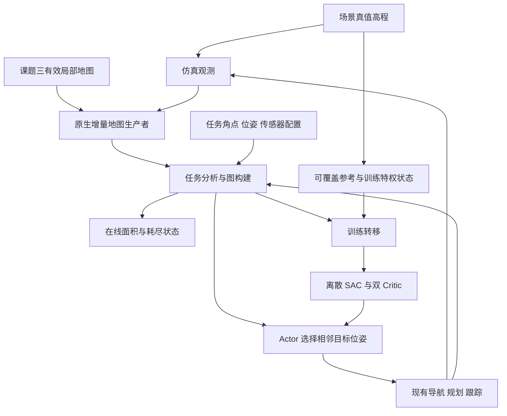

# 面向月表与熔岩洞的图强化学习探索设计

创建：2026-09-12；统一修订：2026-09-15，含 30 倍仿真、并行/学习参数及实施前复审。状态：已完成实现与本机有界集成验证，最终独立复审另行记录。见[实施验证与边界](../../validation/2026-09-15-drl-exploration-redesign-implementation.md)；本页保留设计契约，不以短程功能验证宣称策略质量或目标部署通过。

本文是 `feat/drl-exploration-redesign` 的现行设计，汇总逐项讨论后的决定，替代本文 9 月 12～13 日的方案。文中的“采用”表示设计选择，不表示已有运行证据；工程初值与已确认的任务契约分别标明。[审查记录](../../validation/2026-09-12-drl-exploration-redesign-review.md) 中的早期实验仅适用于当时的定义。

## 1. 基线与实施边界

独立工作树为 `lunar-runtime/.worktrees/drl-exploration-redesign`，分支从 `integration/pure-planner-orin@5c23c13cd0605955412ba6f470ee051d4fe8a9a2` 创建。旧训练所在 `observability-coverage` 工作树仅作实现经验和失败案例来源，不直接搬入其模型、回放或全部导航改动。实施和短程闭环验证均使用独立构建与产物位置，不启停其他训练。

该基线已有任务多边形、原生地图、传统探索、导航和跟踪接口，尚未包含旧工作树完整的 `lunar_drl_exploration`、`GetPolicyMap` 和 `PolicyMapTile`。后续按职责审查复用，不把已有训练脚本称作本版启动入口。

接口依据：[README](../../../README.md)、[操作指令](../../操作指令.md)、[探索任务消息](../../../ros2_ws/src/lunar_pure_exploration_msgs/msg/PureExplorationTask.msg)、[NavigateToPose](../../../ros2_ws/src/lunar_planning_msgs/action/NavigateToPose.action)、[原生通行分类](../../../ros2_ws/src/lunar_incremental_navigation_core/include/lunar_incremental_navigation_core/fine_traversability_builder.hpp)。

## 2. 已确定的任务契约

| 项目 | 采用的定义 |
|---|---|
| 环境 | 月表与熔岩洞，单层起伏地表；每个平面位置对应一层地面，不处理上下叠置楼层 |
| 任务输入 | 地图坐标系下的任务多边形角点及任务命令；典型宽度 100～300 m，最大约 1 km |
| 优化目标 | 优先增加任务区域内的真实观测覆盖，兼顾总路程、转向和决策次数 |
| 任务外区域 | 允许选择任务外相邻节点，也允许导航绕行；任务外观测面积不计奖励，全部运动仍计代价 |
| 完成 | 任务相关探索机会耗尽；80% 为中期指标、99% 为结题指标，均不直接结束回合 |
| 平台 | 最大平移速度 0.2 m/s；可前进、后退、行进中转弯及原地转向，不横移 |
| 首轮观测配置 | 有效距离 10 m、水平视角 90°，整轮训练及各课程固定，不随机化传感器参数 |
| 仿真 | 复用现有导航、规划、跟踪闭环；8 个训练环境，30 倍仿真调度目标；暂不使用 Isaac Sim/Lab |
| 动作 | 少量相邻已知可通行节点与 8 个朝向组成的联合目标位姿 |
| 学习 | 图注意力 Actor、两套独立特权 Critic、非循环离散 SAC；首版不做网络结构创新 |
| 采样与更新 | 8 环境异步采集、1 个 GPU Learner；有效 batch=64，每新增 4 条有效转移做 1 次完整 SAC 更新 |
| 中断接续 | 每 30 分钟墙钟时间保存，项目内专用目录，有限回放和少量覆盖写入的产物 |

任务多边形不是导航围栏。任务外节点可以连接两个任务内区域，也可以从外面观测任务内边界；奖励按实际被观测栅格是否在任务内计算，不按机器人是否在任务内计算。已有 `NavigateToPose` 接口继续负责目标到达，探索器不另写路径约束或控制器。

覆盖优先通过任务定义、奖励和评估体现。加权标量奖励不是严格的词典序优化，不能声称任意地形下都能同时保证最高覆盖和最短路程。

## 3. 职责及数据流



| 所有者 | 负责 | 不承担 |
|---|---|---|
| 地图生产者 | 课题三数据融合、高程派生分类、有效观测标记、增量地图快照 | 策略选点、任务完成、训练奖励 |
| 任务分析 | 任务内已知面积、相关前沿、统一耗尽判据 | 预测未知真值、选择导航路径 |
| 图与动作构建 | 从同一快照生成稀疏图、局部候选、方向特征及实际访问历史 | 网络学习、速度控制、把未知目标当作可执行目标 |
| Actor | 对当前有效联合动作打分并选择目标位姿 | 改地图、决定任务是否完成、读取真值分母 |
| 导航/规划/跟踪 | 路径、避障、跟踪、到达及失败反馈 | 修改覆盖定义、为 Actor 发明观测奖励 |
| 训练环境 | 仿真观测、闭环交互、转移、奖励、回合与资源生命周期 | 维护第二套策略地图或替代导航规划 |
| 参考计算器 | 固定可覆盖集合、评估比例、训练特权状态 | 部署完成判定、Actor 动作筛选 |
| Learner/Replay | 保存经验、批量更新、发布权重、检查点 | 直接调度机器人运动或修改地图事实 |

部署外部信息仍是课题三地图链路、位姿/TF、任务范围和传感器配置。课题三原始局部数据只进入现有地图生产者；探索模块读取其派生快照，不重新融合一遍。

### 3.1 当前控制器来源及训练执行边界

设计基线复用 `lunar_pure_wheeled_controller`，增量路径执行由持续持有状态的 [PathExecutor](../../../ros2_ws/src/lunar_pure_wheeled_controller/python/lunar_pure_wheeled_controller/execution.py) 完成。平移段采用 Pure Pursuit：依据前视目标的横向偏差计算曲率，结合速度得到角速度；同时约束曲率、加减速、角速度及侧向加速度。原地旋转采用角度误差比例反馈与角速度/角加速度、刹停距离约束；执行过程区分制动、对齐、跟踪和终点朝向对齐，支持前进和后退。

`feat/obj-tcp-simulation` 复用同一控制器家族，`ScanControllerNode` 继承公共节点，主要增加仿真扫描速度配置。其当前工作树另有指令平滑、反馈延迟适配、侧向滑移停稳判定等修改，尚未进入本设计分支。因此不能称为“已经使用 TCP 分支完全相同版本的控制器”。通用修正如需引入，归控制器模块单独审查与验证；TCP 协议、轮子指令转换和 Unreal 反馈适配属于桥接层，不是 DRL 训练依赖。

探索策略只输出目标位姿，控制器是环境侧既有执行模块，不参与策略梯度，也不需要由强化学习重新训练。训练可以采用轻量运动学平台承接控制器的 `(v, ω)`，无需启动 TCP/Unreal 或完整轮胎动力学。

从强化学习形式上并不必须运行控制器，但本版已确认的训练基线保留导航控制闭环。若改为按规划路径理想推进，仍需沿路更新位姿、视场和地图，并计算前进、后退、转向及路径长度，同时以执行适配提供导航所需反馈；它省略跟踪误差，改变了环境转移模型。该替代方案尚未纳入基线，不能仅停掉控制器后让导航器等待目标到达，或把目标点跳转当作已有闭环的等价实现。

## 4. 地图与观测定义

### 4.1 三种信息各司其职

- `H_t`：已测量高程及其有效性，归地图模块所有。
- `B_t`：由高程派生的固有地形状态，用于本版二维遮挡近似。已知阻塞格遮挡射线；未知不当作已确认障碍。
- `M_t`：结合平台尺寸、坡度、台阶及足迹要求的导航可通行状态，决定站位、运动和图连接。

二者均复用原生分类器。导航足迹膨胀产生的禁入区不自动成为实体遮挡墙；不连通的已知自由区仍是自由区，其当前可达性单独计算。探索器不靠重标障碍来隐藏未探索区域。

`K_t` 表示本任务开始以来累计有有效观测依据、完成地形分类的栅格集合，包含可通行和不可通行格。仅收到一个无效高程，或仅因邻近障碍膨胀而被导航禁入，都不能凭空产生一次观测。地图修订可以改变当前分类和连通性，累计首次观测奖励不因 FREE/BLOCKED 翻转而重复发放。

地图生产者提供计算所需的有效观测和固有分类信息；它们是同一份派生地图的字段，不是 Actor 增加一套课题三原始输入。Actor 最终只接收第 7 节的图特征及上下文。

### 4.2 训练和仿真的观测近似

真值高程按相同平台规则派生地形，随后模拟 10 m、90° 扇形观测：范围外不可见，射线首先命中的占据格可观测，该格之后被遮挡。首版将固有不可通行地形统一视为二维遮挡，不细分墙、坑和真实三维透视关系。

观测沿实际运动和旋转持续发生，不仅在目标终点更新。采用固定仿真时间步，30 倍只改变墙钟调度，物理平移速度仍不超过 0.2 m/s，不能跳过避障、碰撞及观测中间过程。0.05 仿真秒积分、2 Hz 仿真观测沿用为工程初值，实际倍率单独测量。

达到目标倍率时，每环境每墙钟秒需要推进约 600 个积分步、60 次观测，8 环境合计约 4,800 个积分步、480 次观测。每步理想墙钟预算约 1.67 ms，这不是已测性能。运动、控制 `dt` 和观测节拍使用仿真时间；倍率调度、计算预算、进程等待及 30 分钟保存使用各自明确的墙钟语义。现有导航的规划/地图派生为 10 ms 墙钟后台调度，不能认为设置 `use_sim_time` 就会自动全部加速，也不能机械地将所有后台调度频率乘 30。处理跟不上时允许实际倍率下降，不能通过跳步或减少必要观测维持名义倍率。

栅格视域固定为 `finite_center_tip_prefix_v1`：从量化站位格中心，向量程内每个非零整数格中心发出确定有限射线；同方向只保留最远端点。按实际 yaw 加安装 yaw 对**射线方向**选择 FOV，不再按命中格中心角二次裁剪。沿射线发布每个实际穿越格，包含首个固有 B BLOCKED 事件后停止。精确格角处先把两个侧触格作为同时事件全部发布；任一阻塞便停止，否则再进入对角格。命中格发布的是其中心有效测量，不扩展量程，也不发布未命中的邻居。名义射线方向独立于提供的地图矩形，存储裁剪不产生墙。

原生有限射线前缀事件树统一拥有逐次观测、完整朝向目标查询、八方向计数、直接见证/首个未知接口及参考并集；从站位到目标的关系可能不对称，所有候选站位必须正向验证。原生 FREE 分类需要 3×3 高程邻域；若只回传射线命中中心的高程，首个 BLOCKED 格可能挡住产生其分类所需的邻居，造成封闭墙边永久 UNKNOWN。因此训练传感器明确采用**有效中心地形测量近似**：先用原生测量算子取得中心的坡度、起伏和正向高差，再按同一二维视域裁剪，只发布命中中心的这些测量及中心高程。隐藏邻居的高程、分类和面积不发布、不计覆盖。

这些可选中心测量由唯一地图生产者保存，仍由原生平台阈值完成固有分类，再由原生足迹规则派生导航状态。不是由探索器覆写可通行性，也不把分类阈值复制到 Python。真实课题三只有高程时沿用已有累计高程邻域分类，不要求外部新增字段。此仿真近似表示有效局部地图能确认的中心分类，不声称仅靠可见中心高程就能复原其完整邻域。可选测量的更新、缺失和坐标语义在地图接口及测试中固定，不能沿用过期证据。

`V(q)` 专指上述近似中直接命中且有效分类的中心集合，因此第 5 节的并集成立。若以后改为仅回传逐格原始高程，参考必须同步改为对所有可达视角的累计测量运行分类算子，不能继续假设“先逐帧分类再取并集”等于“先累计测量再分类”。这是观测契约变化，需要独立 schema 与验证。

本版训练使用明确的离散观测原点：按同一 `world_to_cell` 约定把平面观测原点映射到所在站位格中心，朝向仍取实际 yaw。参考使用相同真值导航可达格及格间扫掠关系；逐步仿真和方向 utility 共用该映射。控制位姿、实际动作锚点、路程和转角保持连续值，量程和视角不扩大。首版虚拟传感器平移外参为零，安装偏航可配置；非零平移外参需要连同参考原点定义实现，不能被静默忽略。这样避免连续格角观测与只枚举中心的参考分母不一致。

部署时，完成观测由真实增量地图确认，不把模拟扇形涂到真实地图上。在线可见性估计仅用于图特征；它不是观测事实。

## 5. 可覆盖面积、已覆盖面积与比例

### 5.1 训练参考在场景初始化时固定

令 `T` 为任务多边形对应的栅格，`r` 为计量栅格边长。`Q_reach` 是真值场景中，从初始平台位姿出发、按相同平台几何和运动规则可以到达的观测位姿，包括任务范围外的位姿。`V(q)` 为第 4 节观测模型在位姿 `q` 可有效确认的栅格集合。

\[
E_T=T\cap\bigcup_{q\in Q_{\mathrm{reach}}}V(q),\qquad A_E=r^2|E_T|.
\]

`A_E` 是当前场景、起点、任务、平台和传感器配置下的可覆盖面积，初始化后固定。它统计水平投影面积，不是坡面表面积。传感器配置变化后的独立验证回合重新计算自己的 `E_T`。

“一圈占据格加起点自由连通域”不再作为通用分母：机器人进不去的窄处仍可能有一部分可见，足迹边界也不等于遮挡边界。参考必须围绕可达观测位姿的可见并集计算，不能因策略没有看到某区域就把它删掉。

实现时先求真值可达关系，再对任务相关位置累积位图。超出任务量程邻域的位姿可从视域计算中排除，但可达关系仍允许经远处绕行；不得先裁掉任务外道路。使用共享静态场景、紧凑位图和一致的原生可见性算子，避免逐位姿调用 ROS 或复制整幅高程。目标优先枚举所有量程内原生 R 站位，按距离寻找首个成功前缀；站位自身可直接计入，内部站位和任务外站位均保留。方形距离膨胀及通过 B 非 BLOCKED 连通域的必要条件只作保守预筛，不能代替精确射线及原生 M 可达关系。射线缓存有明确内存上限与共享所有权。参考 ID、场景描述和后续 checkpoint 配置绑定观测语义版本及生成器版本，不能混用旧含义。1 km 初始化成本必须实测，本文不声称已经解决性能瓶颈。

### 5.2 已覆盖和新增覆盖

\[
A_{\mathrm{cov},t}=r^2|E_T\cap K_t|,\qquad
C_t=A_{\mathrm{cov},t}/A_E.
\]

在线可直接得到的面积是：

\[
A_{\mathrm{known},t}=r^2|T\cap K_t|,\qquad
\Delta A_t=r^2|T\cap(K_{t+1}\setminus K_t)|.
\]

在正确、静态且参考与观测一致的仿真中，机器人实际确认的任务格应属于 `E_T`，两种面积一致。出现差异要核对可达性、分类有效性和观测算子，不用钳制比例掩盖。任务开始前已有的有效地图可计入初始覆盖，不给策略额外奖励。

Actor 不读取 `E_T`、`A_E` 或真值覆盖比例。训练 Critic 可以读取这些特权信息；真实推理不需要它们。部署报告已知面积和任务耗尽状态，若没有独立参考面积，就不报告一个虚构的“真实覆盖率”。`A_E=0` 的测试报告参考不适用，不记为 100% 成功。

## 6. 开放与封闭场景共用的完成条件

### 6.1 任务相关探索机会

普通前沿是已知自由区域与未知区域的接口。任务相关前沿还要回答：沿这个入口继续查明，是否仍可能解决任务内的未知区域？方向和范围决定当前站位能观察哪些前沿，导航可达性决定能走到哪些站位。

分析从完整增量地图得到，不依赖 Actor 图中恰好保留了哪些节点：

1. 求平台当前所在的已知可通行可达区域 `R_t`，其中可以包含任务外道路。
2. 按第 4.2 节有限射线模型，从每个候选站位正向求可能观察任务内未知格的关系：候选站位不能是导航状态 `M_t` 已知阻塞，距离不超过量程，视线不能穿过固有地形 `B_t` 的已知阻塞。未知保持潜在可能，不能先假定自由而奖励成片面积。
3. 从这些潜在站位反向分析运动入口，运动扩散使用 `M_t`（未知保持待定），经过未知区及尚未连接 `R_t` 的已知自由岛；抵达 `R_t` 即记录入口并停止穿越 `R_t` 继续扩散。已知不能通过的窄通道不承担运动连接，但仍可以承担量程内的视线。
4. 对相关入口与直接可见的任务未知边界，给出已知可达的观测见证站位、可见边界格及方向关系。无需站到前沿格本身；不能驶入但能看入的区域由这一关系保留。图构建器必须保留或补入见证站位及到达它的已知连接，不能因 2 m 采样遗漏唯一机会。
5. 得到全图任务相关前沿/观测接口集合 `F_task`；只有该集合耗尽才正常结束。搜索触及未知存储边界时保留向外潜在连接，不能用数组边界证明封闭。

上述是算法契约。潜在观察站位查询只需考虑在合并无界外部分量后实际接触 R 的潜在运动分量；没有入口的分量不能产生可执行观察接口，同一外部分量中远离该入口的部分仍保留。直接 R 观察独立计算。直接命中需求的射线必先命中已知非阻塞格旁的首个未知接口（或由未知 R 格出发）；接口不限于任务内。可见接口的 2 倍量程方形膨胀仅构成需求的必要支撑域，域内需求仍逐一精确验证，空支撑域才可排除直接观察。具体增量搜索必须保持运动边界与观测边界的区别，特别不能把足迹膨胀当作射线终点。前沿 utility 只计已知地图支持的边界机会，不估计成片未知高程的可见面积。首个未知接口必须来自一条确实能命中需求格的同模型射线，其见证属于 R；直接观察不依赖需求格所在潜在运动连通分量。八方向 utility 对每个目标合并所有无遮挡支持射线，逐方向去重，不用目标中心方位替代射线方向。针对有限分辨率的边界与分类支撑，需要第 16 节的实现测试。

### 6.2 正常结束、指标与截断

\[
\text{exploration exhausted}\iff F_{\mathrm{task}}=\varnothing.
\]

任务范围内全部已知时，外面的未知不妨碍结束。封闭障碍已排除所有潜在入口时，不要求探索其不可观测内部。如果仍存在从任务外绕回的可能入口，就继续处理相关前沿。

地图存储边界仍是未知，不伪装成墙。生成器 v5 的提供范围包含完整洞室/通道、岩石与陨坑解析支撑再加 12 m 普通上下文，按原有格网整格扩展，保留种子几何、任务和起点/yaw RNG 流；不裁切主洞室地板，也不在数组边缘补墙。场景生成器的物理世界范围和任务范围是两个概念；无界外部且潜在入口一直不能排除时，不能保证有限时间一定证明耗尽，也不能增加一个隐藏的任务外距离截止线来伪造完成。

80% 和 99% 只用于评估及阶段验收。例如耗尽时覆盖率为 93%，本回合正常结束，达到 80% 指标但未达到 99%；需要检查参考、观测、前沿定义或实现遗漏，不能改分母让它通过。达到 99% 但仍有相关机会时继续探索。

连续零收益、局部候选暂时为空、规划失败和课程预算耗尽都不等于探索完成。训练达到决策上限按 `truncated` 处理；真正耗尽才设置 `terminated`。图丢失全图已存在的入口属于表示/实现问题，不能据此宣布任务完成。

## 7. 状态与动作

### 7.1 增量稀疏图

图节点为已知地图中平台可站立的位置，边表示局部已知可通行连接。节点采用稳定世界坐标采样，随地图更新添加、修订及稀疏化。保留通道、岔路、回路、观测位置与必要的中转连接，不能只留下任务内或当前正收益节点。

远处已查明区域可压缩，但不能通过硬截掉远处节点丢失唯一入口。压缩边要有已知可行的连接及距离语义；边端点发送给现有导航，图构建器不额外生成控制轨迹。先保证连通表达，再测量大图成本，不加入 TSP、专家路线或新的高层规划器。

初始采样间距可沿论文工程习惯取 2 m，并由配置调整；它是未实测初值。图坐标、地图分辨率及平台配置与原生地图一致。局部几何读取复用规划所需的窗口及快照，64 m 窗口不是任务大小，也不是把全任务裁成 64 m 的网络输入。

当前位置使用实际平台位姿的临时锚点，不能用附近固定格中心替代；当前位置仅保留朝向超出导航容差、且能看到任务相关待观测前沿的方向；不以已访问标记禁止回访。稳定采样节点、临时锚点与实际观测历史分别保存，不因图重建丢掉世界坐标下的访问信息。

### 7.2 Actor 输入

每个节点 19 维特征：

| 特征 | 维数 | 含义 |
|---|---:|---|
| 相对位置 | 2 | 节点相对于平台的平面坐标，按固定物理长度单位编码 |
| 任务归属 | 1 | 节点是否在任务多边形内 |
| 方向机会 | 8 | 八个朝向扇区可见的任务相关前沿数量/尺度化 utility |
| 方向访问 | 8 | 实际到访并在各方向执行观测的历史标记 |

输入同时包含图连接、当前节点、当前朝向、任务多边形角点、有效距离和视角。角点保留边界形状，不只用中心点或包围盒代替。数值使用固定物理尺度，不因任务面积或当前已展开地图大小改变单位。边长由节点与连接记录得到，供拓扑/代价表达使用。

方向机会依据已知地图、当前任务及传感器配置计算，只评价可见前沿，不读取未知地形真值，不把远处未知默认成等高平地后估计面积。方向访问依据实际轨迹与观测更新，不能仅因发过目标或进入相邻栅格就记为已观测。

访问过仍可以有新机会；方向历史只提供记忆，不将 utility 强制归零或屏蔽重复动作。不再输入局部 CNN 栅格和 GRU 历史；地图及方向访问提供显式记忆，但不能据此证明状态完全满足马尔可夫性。

首轮传感器输入恒为 10 m、90°。保留配置入口有助于部署表达，常量输入本身不代表网络已学会适应新的传感器参数。

### 7.3 联合动作

在当前节点的少量相邻节点中选择下一跳，保留当前位置用于原地转向。候选位置总数至多 20，包含当前位置；每个位置对应 8 个世界坐标系朝向，间隔 45°，过滤后每次最多 160 个联合动作。移动目标必须超出位置到达容差；原地动作必须有待观测前沿且朝向未到达。移动不要求即时收益，区域外绕行仍保留。

\[
a=(j,k),\quad k\in\{0,\ldots,7\},\quad
q_a=(x_j,y_j,k\pi/4).
\]

候选按已知地图和平台的站位/连接规则生成；不允许未知目标冒充可执行目标。任务外节点、已访问节点及即时 utility 为零的中转节点可以被选中。几何上不可执行的位姿不进入有效动作集，不另外增加收益门槛、失败黑名单或连续稳定帧准入。

Actor 对所有有效 `(j,k)` 使用一次联合 softmax。训练采样联合动作；冻结策略验证及部署默认选择联合最大概率动作。不能分别取位置、朝向各自最大值后拼接。

一条转移对应一次完整导航动作：开始时冻结图快照、候选索引和实际目标位姿，结束时累计沿途观测、真实路程和转角。回放中的动作索引绑定原快照，不能在已更新图上重新解释。

## 8. 网络与离散 SAC

### 8.1 Actor 沿用论文结构主线

节点特征经线性映射到 128 维，采用 6 层、8 头图注意力。邻域消息传递以边稀疏实现，不建立全图 `N×N` 注意力矩阵。当前节点对编码后的全图只做一次查询，结合任务角点、当前朝向及传感器能力形成公共上下文。

共享联合位姿打分头结合候选节点、朝向编码、对应方向特征及公共上下文，输出最多 160 个 logits。首版不为每个候选再单独查询全图，不引入候选专属全局注意力或多层策略。

六层局部注意力不意味着每个节点获得全图消息；全局查询用于读取全图编码信息。边稀疏实现的主要计算随边数增长，全局读取随节点数增长，大图内存与延迟仍需测量。

### 8.2 两个独立特权 Critic

训练采用 `Q_1(o_t,s_t^GT,a)`、`Q_2(o_t,s_t^GT,a)` 及各自目标网络。`o_t` 是 Actor 的测量图、任务和历史；特权状态包含真值场景结构、固定可覆盖掩码以及当前已观测状态。不能只给一张不随探索更新的真值地图来预测价值。

Actor、两个 Critic 各自拥有独立可训练参数，可以复用编码器代码，不共享可更新的权重。真值可帮助评价动作，却不能修改 Actor 的候选、有效掩码或在线完成结果。相同测量快照、位姿、任务与传感器配置下，隐藏真值变化不得改变 Actor 输入和输出；Critic 可以变化。

静态真值图按场景共享，转移仅存场景引用与必要的动态观测信息，不能为每条经验复制完整真值高程。Critic 的输入表示也使用稀疏结构及状态标记，不直接对 1 km 高分辨率整图执行密集注意力。稀疏表示是否保留足够结构仍须验证。

这是特权训练设计，不声称压缩图与有限方向历史满足部分可观测问题的无偏价值定理。部署只加载 Actor，不加载 Critic、真值或回放。

### 8.3 更新与自举

对不超过 160 个有效动作计算完整分类期望，避免为离散目标再做高方差动作采样。采用双 Q 的较小值和目标网络软更新：

\[
y_t=r_t+\gamma(1-d_t)\sum_a\pi(a|o_{t+1})
\left[\min_i\bar Q_i(o_{t+1},s^{GT}_{t+1},a)
-\alpha\log\pi(a|o_{t+1})\right].
\]

`d_t` 只表示真实终止。课程上限为采样截断，使用重置前的最后状态自举；不能用下一张地图的初始状态替代。真实耗尽没有后继探索动作，目标直接取本步奖励，不对空动作集求 soft value。

不采用 GRU、burn-in 或序列回放。批处理按图的节点/边组织，Actor 与 Critic 计算采用批量张量操作，避免逐帧 Python 循环及训练热路径上的标量 GPU 同步。

## 9. 奖励、归一化、折扣与熵

### 9.1 已确认的基线

\[
r_t=\frac{\Delta A_t}{100\ \mathrm{m}^2}
-0.02\frac{\Delta L_t}{10\ \mathrm m}
-0.005\frac{\Delta\Theta_t}{\pi\ \mathrm{rad}}
-0.001+b_{\mathrm{done}}\mathbf{1}[d_t=1],\qquad b_{\mathrm{done}}=5.
\]

`ΔA` 是整个动作期间任务内首次有效观测面积；`ΔL` 是实际行驶总距离；`ΔΘ` 是累计绝对转角，而不是首尾朝向之差。任务外路程和原地旋转均计入。2026-09-20按用户要求，正常探索耗尽的最后一条转移额外奖励5（配置项 completion_bonus）。预算截断、导航失败本身和碰撞不获得完成奖励，达到80%或99%也不另加奖励。回合结束后须重置，不能重复领取；初始即耗尽且没有策略动作时不伪造奖励转移。

100 m²、10 m、π rad 是固定物理归一化单位，不使用任务面积、当前地图大小、可覆盖分母或当前扇形面积归一化。同样发现 1 m²，在小图、大图或不同验证传感器下均得到 0.01。

10 m 路程代价为 0.02，90° 转向代价为 0.0025，每次决策代价为 0.001。未耗尽的普通动作中，一次新增 50 m²、行驶 10 m、累计转向 90°，奖励为 `0.4765`；没有新增面积时为 `-0.0235`。这组权重是确认采用的训练基线，尚未被实验验证为最优。

固定单位避免大地图把单位信息收益压到极小，但不能消除拓扑难度或大图样本占比差异。课程采样和按场景分组评估分别处理这些问题，不加入随覆盖阶段改变的权重。

### 9.2 折扣与熵强度

2026-09-20按用户要求，默认改为 `γ=1.0`，配置允许 `0<γ≤1`。后期收益不再按决策步数打折。真实终止不 bootstrap，预算截断仍使用重置前的最后状态 bootstrap。γ=1和函数逼近下的值学习稳定性、完成奖励的效果需通过训练和冻结评估检验；测试通过不代表收敛保证。

\[
H_{\mathrm{target}}=0.10\log N_{\mathrm{valid}},\quad
\alpha_{\mathrm{init}}=5\times10^{-5},\quad
0<\alpha\le10^{-4}.
\]

目标熵随当前有效联合动作数计算，温度在上界内自动调节；达到上界时不承诺一定达到目标熵。若仅一个有效动作，熵为零，不因补齐到 160 个动作虚增目标熵。

最坏情况下 `N_valid=160`：

\[
\alpha H\le10^{-4}\log160\approx0.0005075<0.001.
\]

所以在固定有效配置、准确价值和零新增覆盖的简化条件下，即使取得最大熵补贴，每步仍至少有约 `0.0004925` 的负收益，再扣运动代价。这消除了熵补贴超过静止决策成本的直接目标冲突；不保证函数逼近、采样和导航误差下不会出现循环。

不恢复旧版的高温度、完成大奖或另加循环惩罚。低熵强度能否兼顾发现远期有益动作，由真实训练和冻结验证判断。

## 10. 场景、课程与决策预算

### 10.1 地图来源与课程

首轮使用程序生成的真值高程场景，不要求下载大型资产。月表包含起伏、障碍与绕行地形；洞穴包含通道、岔路、回路及不连通洞室。起点从主要可通行区域采样，不将机器人放在无任务意义的封闭隔离洞室。地图生成不向 Actor 透露真值或可覆盖分母。

随机化地形布局、任务多边形、起点及初始朝向；第一轮各环境均固定 10 m、90°。训练与验证种子分离。8 个环境异步交互，初始按 4 月表、4 洞穴分配，不等待所有环境一起结束或换图。

| 课程 | 主要任务尺度 | 已确认安排 |
|---|---|---|
| 早期 | 40～80 m | 同时学习月表和洞穴的小场景 |
| 中期 | 80～150 m | 混入早期场景，学习较长路线和分支 |
| 后期 | 100～300 m | 保留小中场景，训练主要任务尺度 |
| 扩展验证 | 300～1,000 m | 先作为冻结模型泛化测试，不自动纳入首轮训练 |

课程按有效采集转移数调整混合比例，在下一次环境重置时选择新分布，不中断正在执行的回合。无需“所有小图达到 99%”才能升级。具体阶段转移数、混合比例是训练调度参数，实施清单中给初值并根据覆盖与吞吐调整，不把旧训练计数直接套给新动作。

### 10.2 按课程配置固定决策上限

小、中、大场景分别配置固定决策上限。根据真实回合长度、截断比例和后期覆盖调整，不再使用面积推导公式，也不要求先让前沿参考策略跑完才能开始训练。

可执行的工程起点为小场景 512、中场景 2,048、大场景 8,192 次决策；这些数值不是论文结论，也不是用户另行确认的最优值。场景记录自己的预算类别，混合课程中的小场景仍使用小场景预算。1 km 扩展验证单独配置上限，报告所用数值，不借用论文小图的 128 次作为统一门槛。

达到上限：结束本次采样、记录 `truncated=true`、保留最后状态自举并换图。探索耗尽：`terminated=true`。连续零新增用于诊断，不再叠加一个“连续若干次无收益即完成/失败”的回合机制。前沿方法用于性能对照，不是预算标定或开始训练的前置条件。

## 11. 采集、学习与故障生命周期

一个 worker 对应一套独立仿真、地图和导航闭环，最多一个在执行目标。主进程管理回放和 Learner；模型权重按版本发布，转移记录采集时 Actor 版本。环境之间不共享任务地图或 ROS 名称空间。

### 11.1 已确认的训练初值

| 参数 | 初值 | 语义 |
|---|---|---|
| 采集环境 | 8 个异步环境 | 就绪即继续，不等待全体环境换图或结束 |
| 推理进程 | 1 个集中 CPU 推理进程 | 对已就绪的 1～8 个观测合批，不等待凑满 |
| Learner | 1 个 GPU 学习器 | 更新 Actor、双 Critic 和温度 |
| 有效 batch | 64 条回放转移 | 不与 8 个环境相乘，也不是 64 条循环序列 |
| 实际小批量 | 16 条，梯度累计 4 次 | 显存允许时可取 32×2 或 64×1，保持有效 batch=64 |
| 更新/采集比例 | 0.25 | 每新增 4 条有效转移，产生 1 次完整 SAC 更新需求 |
| 随机预热 | 1,024 条有效转移 | 预热完成后开始学习，预热样本保留作回放 |
| Actor 发布间隔 | 16 次完整更新 | 收到新版本后，在下一次决策使用 |
| CPU 数值算子线程 | 环境 1、集中推理 2、Learner 4 | 与导航执行器、DDS 的线程分开配置，不把所有 ROS 线程限为 1 |
| 数据加载子进程 | 0 | 先使用内存回放，避免额外复制和进程负担 |

这些数值是确认采用的起始配置，不是最优性或吞吐承诺。参考硬件为讨论时实测的 Ryzen 9 9955HX（16 核/32 线程）、30.5 GiB 内存及 RTX 5070 Ti Laptop（约 12 GiB 显存）；不能沿用早先未核实的 RTX 4080/32 GiB 显存假设。

每个有效 batch 的小批量梯度按转移数合并，累计完成后，各优化器才执行一次对应更新；目标网络更新、Actor 发布计数及温度更新也按完整 SAC 更新计数。四次小批量反传不计成四次学习更新。图大小会改变内存需求，不得通过截掉任务相关节点来凑 batch。

完整更新依次执行：TD 目标整体停止梯度；两个 Critic 对四个小批量按各自样本数/64 累计后分别更新一次；随后 Actor 计算完整联合动作期望，读取停止梯度的双 Q 最小值，避免污染 Critic 梯度；温度使用停止梯度的实际熵及逐状态目标熵；最后软更新目标网络一次。有效 batch 不满 64 时不伪装成完整更新。初始学习率为 `1e-5`，目标网络 Polyak 系数为 `0.005`，均为明确可配置的首轮工程值。

更新比例 0.25、batch=64 表示每新增一条经验平均处理 16 个回放训练样本，不保证每条具体经验被抽中恰好 16 次；同一比例下增大 batch 会增加计算量和经验使用量。没有“一条转移必须更新一次”的约束，也不能只靠扩大积压额度弥补吞吐不足。

### 11.2 调度、进度与故障

训练调度采用有界待更新额度与背压：预热之后每条新增有效转移产生 0.25 更新额度，Learner 按完整更新消费；预热采集不积累追补债务。达到配置的积压上限后暂缓派发新动作，已执行动作正常收尾，所得经验不丢弃。不能把超出额度悄悄清零，再声称更新已追上采集。记录采集/s、更新/s、待更新量、实际 batch 及 Actor 版本滞后。

终端保留训练进度显示：课程与累计转移/更新数、吞吐、回放占用、下一次保存倒计时，以及每个环境的场景类别/尺度、回合决策数与上限、覆盖面积和参考比例、路程、新增量、实际仿真倍率及执行原因。决策预算进度与覆盖进度分开；持续训练未设置总转移目标时，不显示虚构的“整体完成百分比”。Q 值、策略熵、温度和更新损失进入有界指标，用于识别循环和价值不稳定。

实施时对上述起始配置进行非循环图批处理测量，结合有效转移/s、更新积压、图节点/边数量、内存峰值及覆盖学习曲线调整。学习率及课程阶段转移数仍在实施清单中明确，不以 GPU 型号推断最优值，也不以传统探索对照通过作为前置条件。第 9 节奖励、折扣与熵配置保持独立，不能在吞吐优化中悄悄改变。

导航失败应按责任与有效数据处理：

- 有可信终态、最终观测和实际运动量的普通目标失败，可以形成真实转移，按同一奖励计算，随后重新决策；不把 `NO_PATH` 写成任务完成。
- 进程退出、服务失联或无法取得有效后继状态的基础设施中断，由 supervisor 恢复该环境。只排除无法构造的在途转移，已完成经验保留；不把基础设施崩溃当作策略负奖励。
- 超时先核对导航是否仍在工作以及终态是否可取得，不能仅凭 `ROUTE_TIMEOUT` 字符串自动推断算法不可达或永久暂停整个槽。
- 模拟碰撞必须作为碰撞/几何一致性故障记录并核对地图、规划和跟踪，不能记为探索耗尽。若无法继续原物理状态，按外部中断结束数据段，不能伪造零值 terminal 来鼓励提前结束。

本版不增加未经讨论的碰撞/失败奖励项。首版训练的可执行候选与既有导航应避免碰撞；若碰撞成为可重复、与策略选择相关的任务事件，需要单独明确其 MDP 语义，不能混入上述基础设施恢复掩盖问题。

恢复次数有界并按环境槽公开状态，反复恢复失败则保存后明确退出；没有静默永久 paused 或无限重试同一目标。恢复只处理生命周期，不能替代修复地图/导航算法。

## 12. 中断接续与有限存储

产物放在项目下的 `training-output/drl-exploration-redesign/`，实施时加入忽略规则。按单调墙钟时间每 1,800 秒触发保存，完成当前优化器更新后形成一致快照，不等待八个长回合结束。

| 产物 | 保留方式 |
|---|---|
| `resume.pt` | 一份可恢复检查点，原子替换；写入时保留上一份直到新文件完成 |
| `best.pt` | 可选，一份依据完整验证选择的 Actor；没有验证时不伪称 best |
| `metrics.jsonl` | 有界滚动指标，不保存逐帧整图；建议上限 8 MiB |
| `run.json` | 配置、种子、schema、计数、代码版本和少量汇总 |
| 独立导出的 Actor | 仅显式导出时写指定单一路径，不按时间戳堆积 |

不默认保存视频、bag、逐步地图图片或每次保存的历史模型。内存回放按字节淘汰旧经验，场景真值及静态图按引用计数回收，避免删了转移却留下越来越多大地图。

沿用回放内存目标 8 GiB、恢复回放快照 2 GiB、总输出预算 20 GiB 作为待实测的工程起点，不把它们当作本机可用资源的最新检测结果。预算包含原子写入临时文件；实施前核对当前资源并将数值写入配置，不人为固定为早期过小的 2 GiB 总产物限额。

检查点保存 Actor、双 Critic 及目标网络、优化器、温度、随机状态、采集/更新计数、课程、更新额度、有限回放、schema 与语义配置。回放引用的真值场景必须一同保存紧凑记录，或由固定版本生成器与种子确定性重建；不能恢复出悬空场景引用。外部下载数据若不可重建，应明确引用依赖。

恢复从新环境回合开始，不宣称复原中断瞬间的 ROS 进程、位姿和在途动作。回放只含已完成转移，旧回合最终观测不能连接新场景初始观测。保存失败保留上一份有效文件，并在终端显示具体原因。

本版观测、动作、网络、奖励和特权 Critic 契约均不同于旧循环策略，首轮新模型从新权重与回放开始；旧产物不自动删除。同一契约内的批处理、性能和生命周期重构支持续训。输出位置、日志级别或保存间隔变化不应阻止语义相同的恢复。

## 13. 推理与任务状态

训练、仿真验证和部署调用同一任务分析、图构建、方向特征和 Actor 内核。差异仅在于观测来源、训练采样/确定性选择、奖励与生命周期；部署不运行真值参考计算或 Critic。

```text
任务范围 + 当前地图 + 位姿 + 传感器配置
                 ↓
      任务相关前沿 / 已知面积 / 耗尽状态
                 ↓ 尚未耗尽
         稀疏图 + 局部联合位姿动作
                 ↓
            Actor 选择目标
                 ↓
       NavigateToPose → 实际执行与地图更新
```

保留 `START/PAUSE/RESUME/CANCEL`。暂停/取消沿用导航取消及停稳流程，地图与有效访问历史保留；恢复刷新快照再选目标，不重放已过期动作。探索进程不发布 `/Car/T5/Car_Cmd_Vel`，控制器仍是唯一速度发布者。

在线状态报告已知面积、相关前沿数、耗尽/执行/失败/暂停原因、地图版本。真实场景没有 `A_E` 时，不把“已知面积/任务总面积”当作真实可覆盖率；如保留这个辅助比例，须明确命名为任务面积已知比例。新学习入口不改变传统探索接口的既有含义，缺少参考的字段明确表示不可用。

传感器配置首版在任务开始时加载，任务期间固定。后续换配置再开始任务时，重建相应可见性特征；8 个朝向与网络维数不自动改变。本设计没有承诺任意参数热更新或未经训练范围的可靠性。

## 14. 冻结验证与传感器泛化

### 14.1 主验证

验证读取冻结 Actor，使用与训练分离的固定种子、地图和起点，默认联合 argmax；不更新权重、不向训练回放写入经验。8 个训练槽均用于采集，完整验证单独运行，不让 E0 长期承担验证任务。

报告按月表/洞穴和尺度分组：80%/99% 达标率、耗尽比例、耗尽时参考覆盖、最终覆盖、达到 80%/99% 的实际路程、80% 到 99% 的尾部路程、零新增比例、预算截断、导航失败和碰撞。未达标的案例保留，不能仅对成功案例的均值声称路线更短。

参考方法与 Actor 使用相同测量地图、传感器、任务、完成判据和导航后端。最近相关前沿及收益/代价策略用于对照；不向它们开放真值，不把其全部通过作为训练准入条件。局部动作受限和传统宏目标版本如同时比较，应分别说明动作差异。

保存 best 时预先固定评估口径：先比较 99% 达标率，再比较总体参考覆盖，最后比较可比较案例的路程；同时保留 80% 和耗尽结果。只达到耗尽但覆盖较低不能胜过高覆盖模型。缺少完整验证仍可导出当前 Actor，文件注明来源。

### 14.2 首轮固定训练，随后改变传感器配置测试

首轮所有训练回合固定 `range=10 m, fov=90°`，不进行传感器域随机化。验证先运行相同配置基线，再做单变量变化，以区分量程和视角的影响。

| 验证组 | 距离 | 视角 | 用途 |
|---|---:|---:|---|
| 基线 | 10 m | 90° | 同配置表现 |
| 量程变化 | 5 m、15 m | 90° | 建议的短/长量程测试点 |
| 视角变化 | 10 m | 60°、120°、180° | 建议的窄/宽视角测试点 |

表中非基线数值是验证初值，不表示已经支持这些范围；可按实际设备配置调整。主比较使用相同场景、任务与起点，模型冻结，重新计算方向特征和该配置的固定 `E_T`。奖励物理单位保持不变。

不同传感器可能改变可覆盖分母，所以必须同时报告覆盖百分比、已覆盖 m²、可覆盖 m² 和实际路程，不能单凭更小分母带来的百分比提高宣称泛化更好。大尺度和传感器变化先分别测试，再按需要组合，避免把两个分布变化混为一个原因。

常量传感器输入没有提供学习其变化规律的训练信号；能否泛化依赖测量图、方向机会表示与学得决策的迁移，需要测试证据。若新配置明显退化，后续再加入相应训练分布或微调，并保留原冻结结果；微调后的成绩不得标为无需训练的泛化。

## 15. 接口与代码落点

以下名称是未来实施契约，当前文件中不暗示类型或服务已存在。

| 类型/单元 | 最小内容或落点 |
|---|---|
| `TaskSpec` | 任务 ID、坐标系、多边形；任务指标与训练预算属于各自配置 |
| `SensorSpec` | 有效距离、水平视角、相对平台的既有几何配置 |
| `MapSnapshot` | epoch/revision、分辨率、坐标原点、只读瓦片、有效分类/固有地形/导航状态、平台配置引用 |
| `TaskReport` | 已知面积、新增面积、任务相关前沿/观测接口、耗尽状态和地图版本 |
| `DecisionObservation` | 19 维节点、边、当前节点、角点、平台/传感器上下文、有效联合动作、冻结目标位姿、schema |
| `PrivilegedState` | 训练私有场景引用、真值结构、固定参考和当前观测状态；不经过部署接口 |
| `Transition` | 当前/后继观测及特权引用、联合动作、分项奖励、terminated/truncated、回合/权重版本 |
| 纯探索核心 | 任务分析、图与方向动作构建；复用原多边形数学，独立于 ROS 与 PyTorch |
| 导航地图导出 | 审查复用只读瓦片/版本接口，补足同一地图的派生字段，不另起一个地图生产者 |
| DRL 包 | Actor、独立双 Critic、SAC、回放、检查点、训练/推理运行器；观测与动作内核共用 |
| 场景与仿真 | 程序高程、统一观测算子、参考集合、现有 plant 与导航适配 |
| 配置与操作文档 | 构建、训练、恢复、验证、导出、部署命令；实施后按真实入口更新 |

大型任务采用瓦片或紧凑集合，不能直接沿用约百万格的整幅任务栅格容量来处理 1 km/0.2 m 的约 2,500 万格，也不能仅提高上限而忽略内存。64 m 局部规划窗口继续服务局部几何，不承担全局任务内存。

新观测/动作/特权状态使用独立版本标识，不能在旧 checkpoint schema 下悄悄换输入。地图版本、任务 ID、Action 身份沿用已有归属关系；不增加一套重复审批或地图稳定性认证。

旧跟踪器或路线规划修复若确为依赖，按其所属模块单独说明和验证，不把整套旧导航源码作为学习包附带导入。传统与学习探索入口显式选择，一次任务只有一个目标发布者，不偷偷切换策略。

## 16. 验证要求与局限

实施应覆盖以下关键反例与契约，而不是先设置很多场景准入门槛：

1. 开放任务已知、外部未知：正确耗尽；无关外部口袋不延长任务。
2. 封闭洞室、任务外入口和未知连接后的自由岛：连通与相关性正确，不把不连通自由改成障碍。
3. 足迹膨胀、可见但不可驶入的窄处、格角和瓦片边界：独立连续闭格方形交点 oracle 检验同时侧触事件、任意安装 yaw/FOV、所有目标和八朝向；全部原生 R 站位枚举与参考一致，包含内部及任务外站位。已命中分类输入回放后同姿态/FOV不能新增虚假可见格，保留 7×7 原始反例和随机例。完整原生洞穴的实际命中测量经唯一生产者回放后，显式比较 R、已知面积与 E、任务耗尽及零残留接口；生成范围须包含 300 m/1 km 的完整解析特征。
4. 固定相同测量输入但改变隐藏真值：Actor 输入、动作和在线状态不变；特权 Critic 允许变化。
5. 转动时实际观测、到达容差和相邻栅格访问：方向历史来自执行，首次面积不重复奖励。
6. 图稀疏化保留任务相关连接；少量邻接动作可以通过零即时收益节点完成长程绕行。
7. 联合概率归一、掩码及回放目标一致；批处理与逐图参考相符；真实终止与预算截断正确自举。
8. 保存/恢复包含有效场景引用、优化器和温度，不拼接新旧回合；环境故障不永久静默占槽。
9. 冻结模型分别测试场景尺度与传感器变化，完整保留失败及截断，记录尾部覆盖和 Q/熵行为。

正常耗尽却残留理论可取得参考面积是必须调查的失败现象，不因状态名为完成就豁免。抽象连通小例或纯公式检查不能证明上述可见性、稀疏图、学习或导航闭环正确。

性能分项记录真值初始化、地图导出、任务分析、图更新、Actor 推理、导航执行、SGD、保存及内存峰值。30 倍为目标，8 环境在本机是否达到该倍率需要测量。折扣、低温度、固定成本及较长局部决策链可能带来价值估计与学习速度问题，不能承诺固定转移数收敛。

原设计阶段仅有接口阅读、文献核对及文档检查；当前 Tasks1–9 已实现并完成各任务独立复审。本机 Jazzy 已验证原生地图/观测、任务图、导航与公共控制器闭环，以及全尺寸 SAC 的 8 环境有界采集、GPU 更新、保存/恢复。全分支首轮复审提出的安装角方向历史、冻结评估绝对面积及状态文档问题均已修正；2026-09-16 限定范围复审确认 I1/I2/M1 全部解决，未发现新增问题，本机开发实现复审通过，详见[实施验证](../../validation/2026-09-15-drl-exploration-redesign-implementation.md)。正式训练收敛、80/99 与策略耗尽质量、传感器/场景泛化、完整 1 km ROS 任务、Humble/Orin、真实课题三、跨主机 DDS 与车辆仍为 `NOT_RUN`。二维遮挡是任务近似，数值耗尽或短程闭环不自动证明现场验收通过。

## 17. 相对早期文档与旧实现的变化

| 维度 | 早期方案/旧实现 | 本次确定 |
|---|---|---|
| 可覆盖参考 | 高程可见性细分，随后曾建议自由连通域加一圈阻塞 | 可达观测位姿的统一二维有效视域并集 |
| 在线完成 | 参考比例或单一潜在未知集合 | 全图任务相关前沿/观测机会耗尽；80%/99% 独立评估 |
| 任务范围 | 曾仅允许任务内动作 | 任务内计面积，任务内外相邻节点均可选，导航自行绕行 |
| 输入 | 栅格 CNN、复杂节点特征、GRU；早期文档另有 12 维节点 | 19 维节点、拓扑、任务角点及平台/传感器上下文，无循环编码 |
| 动作 | 全图大量候选；早期文档 12 个朝向及条件头 | 最多 20 个局部位置 × 8 朝向，一次联合 softmax |
| 网络 | 早期文档 3 层注意力、禁止 Critic 真值 | 6 层图注意力、一次全图读取、独立双特权 Critic |
| 奖励/折扣 | 传感器面积归一化、完成奖励、γ=0.999 | 固定物理单位、正常耗尽奖励5、γ=1、小温度与决策成本 |
| 课程预算 | 面积公式或先用前沿标定 | 各课程固定上限，按运行数据调整，预算只截断 |
| 传感器训练 | 曾讨论参数随机化 | 首轮固定 10 m、90°，冻结验证测试配置泛化 |
| 大场景 | 曾计划 1 km 混入训练 | 主要训练至 300 m，300～1,000 m 先扩展验证 |
| 运行保留 | 原生导航、8 环境、30 分钟保存 | 保留；仿真调度目标 30 倍、物理限速仍 0.2 m/s |

这是新的学习契约，不是仅删掉输入通道或调整几个奖励系数。职责仍围绕地图、策略、导航、控制、环境、学习分别落实，不新增平行地图生产者或策略之外的路线专家。

## 18. 文献依据与采用边界

- [Cao 等，Deep Reinforcement Learning-based Large-scale Robot Exploration，RA-L 2024](https://arxiv.org/html/2403.10833v1)：主要结构参考，包括图表示、少量邻接动作、六层邻域注意力、当前节点全图读取及特权价值学习。本项目加入任务多边形与有限视角联合位姿，不把论文全向观测效果当成自己的证据。
- [论文原始 main 分支代码](https://github.com/marmotlab/large-scale-DRL-exploration/tree/main)：训练 worker 使用 128 次循环上限，原文 γ=1；它没有给出本项目按尺度的预算公式，也没有要求先运行前沿校准。本项目不照搬 128。复现还应区分正文目标熵 0.01·log(k) 与该分支代码的 0.05·log(k)。
- [MARVEL，ICRA 2025](https://arxiv.org/html/2502.20217v1)：有限视角、方向特征和联合位姿设计的相关先例；包含冻结策略在不同视角/量程下的实验，但不能证明本项目的配置泛化。方向建模不作为首创声明。
- [Soft Actor-Critic for Discrete Action Settings](https://arxiv.org/abs/1910.07207)：离散策略的完整动作期望。本文的权重和温度上界来自项目目标及数值核对，不是论文给出的通用最优数值。
- [Unbiased Asymmetric Reinforcement Learning under Partial Observability](https://arxiv.org/abs/2105.11674)：特权状态与历史/观测的价值条件化问题。当前压缩图历史没有无偏理论保证。
- [Time Limits in Reinforcement Learning](https://arxiv.org/abs/1712.00378) 与 [Gymnasium 时间限制说明](https://gymnasium.farama.org/tutorials/gymnasium_basics/handling_time_limits/)：外部采样上限与真实终止分开，正确使用最后状态自举。
- [SAC](https://proceedings.mlr.press/v80/haarnoja18b/haarnoja18b.pdf)：奖励尺度与熵温度耦合。第 9 节的零增益软收益上界是本设计的代数检查，不是实验结果。

第一版优先验证论文结构在本任务和真实导航闭环中的适用性。更复杂的网络、多层路线决策、传感器随机化或额外奖励，仅在独立结果说明需要时另行讨论。

## 2026-09-18 动作修正与训练切换

策略契约升为 `task_graph_v2`，动作契约 `joint_pose_valid_observation_v2`。19 维节点特征、网络层数及奖励不变；旧 Actor/全量检查点不能直接恢复或重新标记后导出为新策略。旧模型保留用于旧构建环境中的离线对照。新模型、优化器、回放从头初始化。

`config/drl_exploration_small.yaml` 固定小场景分布，输出到 `training-output/drl-valid-actions-small`；`config/drl_exploration.yaml` 保留正式课程，输出到 `training-output/drl-valid-actions`。8 环境、30 倍目标倍率、batch64、30 分钟保存不变。小场景闭环验证后再开始正式课程。
