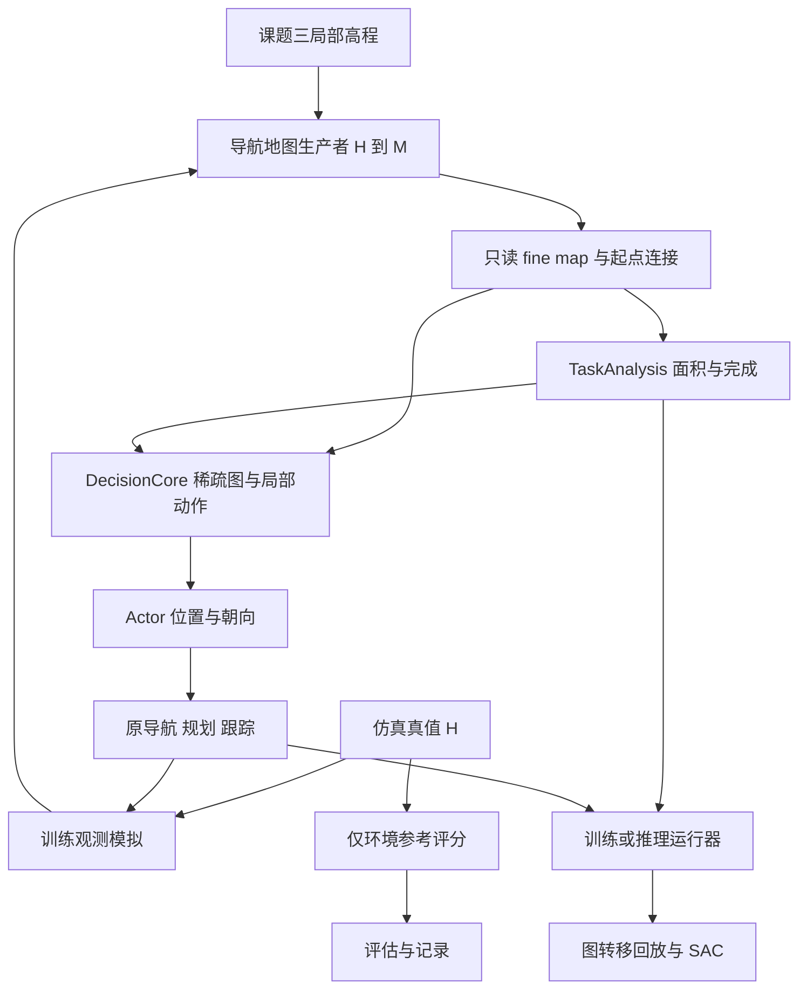

# 面向导航地图构建的强化学习探索重构设计

日期：2026-09-12。状态：本分支的设计交付，算法、接口扩展、训练和部署均未实施。

本设计重新确定任务、地图语义、决策层级及学习边界。下面的“采用”表示本设计的选定方案，不表示代码已经具有该能力。

## 1. 分支、基线与交付范围

- 分支：`feat/drl-exploration-redesign`。
- 工作树：`lunar-runtime/.worktrees/drl-exploration-redesign`。
- 起点：`integration/pure-planner-orin@5c23c13cd0605955412ba6f470ee051d4fe8a9a2`。
- 旧训练参考：相邻 `observability-coverage` 工作树，`fix/observability-coverage@df469d1` 加当时未提交的源码与文档。该 HEAD 不代表完整旧训练实现。
- 本次只编写设计和审查记录，不复制模型、回放、构建目录，不启停训练，不修改车辆接口运行状态。

新分支已有导航和传统探索基础，但没有旧工作树中的 `lunar_drl_exploration`、`GetPolicyMap`、`PolicyMapTile` 等完整训练扩展。后续实施必须按第 16 节选取依赖，不能把“从 integration 创建分支”误认为已经带入旧训练器。

相关现有接口依据：[README](../../../README.md)、[操作指令](../../操作指令.md)、[NavigateToPose](../../../ros2_ws/src/lunar_planning_msgs/action/NavigateToPose.action)、[PureExplorationTask](../../../ros2_ws/src/lunar_pure_exploration_msgs/msg/PureExplorationTask.msg)、[原生通行判定](../../../ros2_ws/src/lunar_incremental_navigation_core/include/lunar_incremental_navigation_core/fine_traversability_builder.hpp)。

## 2. 任务范围与目标

### 2.1 要解决的任务

单台轮式平台在起初未知的地形中，增量查明任务多边形内对导航有意义的区域：从起点所在自由连通域能够到达的自由栅格，以及紧邻该域的不可通行边界。学习策略决定下一观测位姿，目标是完成该任务，并减少完成所需的总路程。

“覆盖优先”落实为完成语义和评估排序；标量训练奖励是该目标的代理，不声称一组固定权重能严格实现所有场景中的词典序最优。

| 已确定约束 | 本设计处理 |
|---|---|
| 典型任务宽度 100～300 m，最大约 1 km | 固定世界栅格计量；局部细图和全局稀疏图表达地图 |
| 任务范围由角点输入 | 复用 `PureExplorationTask.boundary`、任务命令及格心归属语义 |
| 允许任务外绕行 | 任务范围只裁剪计量，不裁剪已知路线或潜在连通分析 |
| 无业务时间上限 | 不用超时、零收益次数或训练步数宣布探索完成 |
| 最高速度 0.2 m/s | 保留前进、后退、运动中转弯和原地旋转；无横移 |
| 10 m、90° 可配置视场 | 训练模拟观测；实际任务由课题三地图提供证据 |
| 8 个环境、10 倍仿真 | 主训练继续执行原导航、规划、跟踪和碰撞闭环 |
| 每 30 分钟保存，项目内存储 | 单个恢复检查点、单个最佳策略及有界指标 |

任务可以从多边形外开始。起点与任务之间的未知通道通过相同的任务相关边界表达，不要求先把整个车体驶入多边形才允许探索决策。

### 2.2 本版范围

训练地图为程序生成的月表和单层洞穴；策略不接收场景类别标签。业务状态统一处理开放、封闭和混合地形。

不学习 SLAM、地图分类、底层避障或轮子控制；不使用 Isaac、地图生成大模型、专家 TSP 教师或额外的运动平滑器。不建立第二个可通行性生产者。本版不声称支持多层重叠洞穴、顶板和完整轮胎动力学。

## 3. 选定的决策层级及其他路线

**采用：全局图理解任务结构，Actor 选择局部路点及观测朝向，由现有导航执行。**

| 路线 | 取舍 |
|---|---|
| 全局信息图＋局部位姿动作 | 本版采用。全局结构指导方向，单次运动尺度与局部地图一致，允许穿越零收益已知通道 |
| 直接选择全局前沿 | 可作为对照，但单次目标路程变化大，继续把远距离执行等待耦合到每条学习经验 |
| 在全图回归任意连续位姿 | 不采用。需要额外学习有效空间及可执行目标约束，重复导航职责 |

这不是把旧网络中的若干层关掉：状态来自一份任务相关图，动作限定为该图的下一步，覆盖和结束由独立任务分析定义，学习单位和恢复数据也随之重新定义。

采用离散位置选择和条件朝向选择。输出仍是 `NavigateToPose(x,y,yaw)`；不要求连续回归，不把全局所有节点都当作当前动作。

## 4. 唯一地图来源与三种语义

| 符号 | 含义 | 所有者 |
|---|---|---|
| `H_t, O_t` | 累积高程证据及直接收到高程的标记 | 导航地图模块；源数据来自课题三或仿真补丁 |
| `Q_t` | 未施加整个平台包络的固有地形分类 | 现有 `PlatformElevationEvaluator` |
| `M_t` | 考虑平台包络后的最终 `UNKNOWN/FREE/BLOCKED` | 现有 `FineCellEvaluator` 和 fine snapshot |
| `T` | 任务多边形在固定世界格上的集合 | 探索任务分析 |
| `Ω` | 允许活动的空间；不等于 `T` | 已有运行边界配置；没有边界时按未知外部处理 |

`FREE` 是局部通行性质，不表示与机器人全局连通。不连通的 `FREE` 不改成 `BLOCKED`。`BLOCKED` 可以由平台包络推导，不要求该格本身直接测得高程。`UNKNOWN` 包括缺少支撑证据的格和未分配瓦片，数组边界不能充当障碍。

策略读取导航生产者导出的 `M_t`、代价、几何和当前起点连接信息。策略层不订阅课题三原始地图，也不自行从高程再造 `M_t`。只读瓦片缓存属于传输缓存，不拥有修改导航事实的权力。

`Q_t` 是复用现有地形判断所需的内部阶段，本版仅供训练传感器模拟调用；不要求把它变成新外部输入或网络通道。实际推理不执行传感器仿真或未知高程估计。

## 5. 面积定义

所有计量使用 fine map 的固定世界格和分辨率 `r`，初始训练配置 `r=0.2 m`。业务面积单位为 m²，不使用策略节点数代表面积。

### 5.1 环境私有的可覆盖参考

用完整真值高程和同一个平台配置派生三态 `M*`。在整个 `Ω` 上计算，再裁剪任务：

\[
R^*=CC_4(\{c\in\Omega:M^*(c)=FREE\},p_0)
\]

\[
B_\partial^*=\{b\in\Omega:M^*(b)=BLOCKED,\ N_4(b)\cap R^*\ne\varnothing\}
\]

\[
E^*=T\cap(R^*\cup B_\partial^*),\qquad A_E=|E^*|r^2
\]

“一圈”是四邻域一层，不是整个障碍体，也不再按平台半径膨胀一次。四连通用于任务定义，禁止从对角障碍间穿过；运动规划仍沿用原生连接与运动判断，不由这份集合替代。

`E*` 和 `A_E` 在场景初始化后固定，只由环境评估器持有。Actor、Critic、候选生成和在线任务完成模块均不可访问。若 `A_E=0`，比例显示为“不适用”，仍由在线规则判断任务状态，不通过除零或钳制生成 100%。

这是本项目“导航地图覆盖”的操作定义，不是真实传感器地表可见性的精确计算，也不是通用文献标准。初始化不再计算全可达区域的高程视域并集。

### 5.2 两端可计算的已知面积与训练覆盖

\[
K_t=\{c:M_t(c)\in\{FREE,BLOCKED\}\}
\]

\[
A_{known}(t)=|K_t\cap T|r^2,\quad C_{task}(t)=A_{known}(t)/(|T|r^2)
\]

\[
A_{cov}^*(t)=|K_t\cap E^*|r^2,\quad C^*(t)=A_{cov}^*(t)/A_E
\]

`A_known` 可能包含 `E*` 外的格，不能拿它直接除以 `A_E`。部署报告 `A_known/C_task` 和任务状态，不伪称知道真值覆盖率。

另保留直接测得高程面积 `A_observed=|O_t∩T|r²` 供地图诊断，不用于本版探索成功和奖励。覆盖统计随当前地图变化；已知退回未知时 `A_known` 可以下降。

奖励账本用独立的本回合首次确认集合 `K_ever`。`FREE↔BLOCKED` 不重复奖励，`KNOWN→UNKNOWN→KNOWN` 也不重复奖励。该账本不改地图状态，不用于把未知格伪装成已覆盖。

新任务开始时用当前已知任务格初始化 `K_ever`，已有地图信息不作为首个动作的新增奖励。真实新任务不清空导航持久地图；仿真换场景则更换地图 epoch。初始化时已满足完成条件的任务可以零动作结束，记录初始完成，不伪造一条空动作训练样本。

## 6. 统一的在线完成规则

只在判断探索可能性时，把未知格看作尚有可能通过。设 `F_t`、`U_t` 分别为 `M_t` 中自由和未知格：

\[
P_t=CC_4(F_t\cup U_t,p_t;\Omega),\quad W_t=T\cap U_t\cap P_t
\]

`P_t` 的根由导航给出的当前平台自由连接确定，不能用临时假设的起点补丁制造已知自由证据。尚无有效连接时报告等待输入，不返回完成。

**在线完成条件唯一为 `W_t=∅`。** 其含义是：任务内已经没有未知格，还可能通过未被已知障碍封闭的路径与平台连通。

- 任务内已全部查明，外面仍开放：可以完成。
- 封闭洞室内部仍未知，已知阻塞已经形成闭合分隔：可排除。
- 任务内未知区域可能从任务外绕回：继续探索。
- 没有动作、规划失败或连续零收益：不构成完成。
- 动态证据修订改变连通关系：重新分析；本版完成命令停止后不会自动重启任务，由新任务/显式恢复触发再检查。

`A_unresolved=|W_t|r²` 是“尚未排除的任务未知面积”，不是准确剩余可覆盖面积。它可能包含最终证实不可进入的区域；其减少本身不计奖励。

### 6.1 开放空间和有限存储

按 fine tiles 维护非 `BLOCKED` 的局部连通分量及边界接口。相邻瓦片按真实共享边连接，发生障碍插入或删除时允许分量拆分和重建，不能只使用不可拆分的并查集。

分析范围包住任务和全部已知瓦片，再加未知外圈。未给定活动边界时，外圈连接一个虚拟外部节点；它表示更远处仍未知的空间，只参加潜在连通分析。它不是候选、导航路线或面积。

全未知瓦片可压缩为一个局部分量，但不能把被已知障碍隔开的多个未知分量直接合并。以小图完整 flood-fill 作为实现参照，压缩只能改变计算成本，不能改变 `W_t`。

仿真已有的有限活动边界是公开运行约束，统一传给导航合法域、碰撞和完成模块；不把边界写成测得的墙。实机无此先验时不要求补交边界，也不使用任意固定缓冲带证明不可达。

无界外部若始终存在未排除的绕行可能，有限观测不能证明任务结束。系统报告仍有未解决区域，不能靠训练上限替代证据。

### 6.2 覆盖率与完成率的关系

`evaluation.coverage_milestone=0.95` 记录达到参考覆盖 95% 的路程，不作为训练或推理的自动终止条件。默认任务是继续查明至上述在线完成。

在静态、分类正确、同一 `Ω` 与四连通定义下，在线完成应意味着 `E*` 全部已知：任何未查明的 `R*` 或边界格都仍通过真实自由路径与根潜在连通，会落入 `W_t`。这是一项定义一致性性质，不证明策略一定找到完成路线。

反向不一定成立：`C*=100%` 时，仍可能需要在任务外查明障碍，才能排除任务内其他未知分量。严格区分达到覆盖里程碑、在线完成、参考格漏报和采样截断。

## 7. 训练观测模型

### 7.1 观测单元

训练真值高程 `H*` 通过原生固有地形评估得到 `Q*`。射线采用二维格遍历：自由地形透过，第一个固有阻塞地形单元可被观测，其后不揭示。模型不细分墙、坑或坡面的光学行为。

不能使用包络膨胀后的 `M*=BLOCKED` 遮挡高程。否则射线可能停在障碍前的平地，在线地图永远拿不到真正产生阻塞的证据。

传感配置为距离 10 m、水平视角 90°、安装偏航 0、仿真时间 2 Hz；可修改配置。无高程 LOS、未知目标等高或“半个平台高度”的可见性推断。

### 7.2 保留真实地图链所需的有限支撑

原生地形分类需要高程邻域，本版将观测单元定义为：扇形和射线可触达的中心格，加原生分类所需的一次有限高程支撑，当前为 3×3。

中心格满足标称量程及 FOV；返回支撑可以超出格中心的视场边缘一格，但不得递归扩展或揭示障碍后整片高程。按格中心覆盖查询和不穿角的 DDA 实现，避免稀疏角度采样遗漏永远照不到的格。

这是分类观测的明确近似，不是严格点传感器。`O_t` 只记录真正发送的高程样本。原地图生产者收到有限补丁后照常派生 `Q_t/M_t`，仿真不直接把真值导航格注入策略缓存。

100% 参考覆盖是仿真一致性检查目标，不预先保证任何平台、分辨率或量程都成立。若原生证据支撑使参考格无法查明，作为观测模型缺陷报告，不能事后缩小 `E*` 让场景通过。

## 8. 任务相关图与前沿

### 8.1 两种连通图不能混用

任务分析中的 `P_t` 允许未知，仅回答“还可能探索哪里”。策略运动图 `G_t` 只从已知 `FREE` 构建，仅用于地图结构表达和候选路径长度估计。

在固定世界 2 m 块中保留每个自由连通分量的代表点，保留块间共享自由接口。禁止把同块内隔墙两侧合为一个点；窄通道不能因为粗网格中心恰落在障碍上而消失。

局部保留精细节点；远处按 32 m 块及内部连通分量聚合，保留跨区域接口和路线长度。不同连通分量不能为减少节点而合并。区域节点和路径只用于策略上下文，不直接成为当前位置的动作。

局部范围继承导航 `BuildLocalPlanningWindow`，当前 64 m。策略的 2 m/32 m 是抽象图尺度，不修改导航 0.2 m 精度、局部窗口和避障参数。

对块内绕行造成过长的抽象边，在其已知自由连接序列上插入中间路点，使局部决策边不超过 10 m。10 m 是沿图连接的长度，不只是两点欧氏距离；原生最终执行路程可能不同。

### 8.2 任务相关前沿

先令 `R_t=CC4(F_t,p_t)` 为当前已知自由根分量。前沿是 `R_t` 和未知之间的共享边。为避免把能经已知道路返回的所有外部前沿都叫作任务相关，先从潜在图中去掉 `R_t`，再对 `(F_t∪U_t)\R_t` 求连通分量。仅当某前沿的未知侧所属分量与 `W_t` 相交时，该前沿才提供任务相关信息。

这允许未知路径中穿过已经观测但尚未与根连接的自由岛，也允许出任务范围绕回；不允许用“先退回已经走通的根分量，再去另一个前沿”的路线制造关联。外部仍全未知时，关联可能保守而宽泛，这是未观测造成的不确定性，不通过固定绕行半径强行消除。任务全部解决时 `W_t` 为空，外部前沿全部退出本任务。

可见前沿特征由已知地图计算：从节点到自由侧的连线位于已知自由空间，长度在量程内，并落入相应朝向的扇形。信息量用前沿长度表示，不预测未知高程或障碍背后的可见地表面积。

该特征是已知地图上的探索机会，不是实际观测面积。前沿已经被分类消除时随地图重算；即使估计高，奖励也只来自实际分类增量。

路点中保留必要的零收益通行点。没有局部前沿时，远处任务相关前沿经稀疏图参与决策；不另用一套贪心探索器强制接管。

## 9. 动作契约：邻接路点＋条件朝向

一个学习动作是一次完整 `NavigateToPose`，而不是控制周期。

位置集合 `V_action` 仅包括机器人当前图节点的下一跳局部路点，以及可原地观测的当前位置。根连接来自原生地图接口；若抽象表示缺少与根对应的节点，在已知连接上插入根，不将假设起点格当作可执行目标。

不在全图做任意 top-K 丢弃分支；动作数量由局部拓扑和物理边长决定。记录实际数量分布，用测试核对窄通道、折返和多分支都保留下一步选择。

朝向集合 `Θ` 使用 12 个世界坐标系方向，间隔 30°，可由配置更改。Actor 联合学习位置和朝向：

\[
\pi(v,k\mid o)=\pi_v(v\mid o)\pi_\theta(k\mid v,o),\qquad a=(v,k)
\]

位置和朝向同时满足导航容差的空动作不进入有效集合。移动到已访问位置、在原地观察另一方向均是有效动作，不用“去过一次”永久封禁。

每个观测快照冻结节点 ID、动作行与 `(x,y,yaw)` 对应关系；执行后保存当时的动作索引。后续图更新不能重新解释旧经验中的动作。世界朝向用于稳定动作含义，网络读取相对朝向的 sin/cos。

动作列表只复用地图的已知自由和原生起点连接，不为每个候选调用完整规划器，也不建立新碰撞认证链。图连接不是 `PLAN_FOUND`；选定后仍由原导航决定可执行路线和终态。

## 10. 模型架构与输入契约

### 10.1 状态组织

策略观察 `o_t=(G_t,robot_t,task_t,V_action,view_features_t,feedback_t)`。地图和完整运动轨迹派生的访问标记承担显式空间记忆；不回放多帧局部图像，不使用 GRU。

本选择基于新的决策分工：策略学习地图上的访问顺序，地形解释与运动执行已经由上游负责。它不声称这是一般 POMDP 的充分统计量；地图错误与未表达历史仍可能限制性能，必须用固定失败场景验证。

| 输入 | 维度及顺序 |
|---|---|
| 节点 `node_features` | 12：相对 x/y、图距离、可见相关前沿总长度、其中任务内长度、关联未解决面积、访问标记、平均通行代价、任务内比例、robot/local/region 三个类型位 |
| 边 `edge_features` | 2：连接长度、平均通行代价；连接端点另用稀疏整数索引 |
| 任务边界 `task_boundary` | 每个角点 4 维：相对 x/y、到下一个角点的边向量 x/y；保留输入多边形顺序和有效点掩码 |
| 平台与任务 `context` | 12：朝向 sin/cos、任务质心相对 x/y、任务宽高、任务已知比例、未解决比例、FOV 比例、上次实际路程、上次实际转角、上次执行失败位 |
| 每个位置的朝向 `view_features` | 6：目标相对朝向 sin/cos、该扇形相关前沿长度、其中任务内前沿长度、该方向是否已扫描、相对当前朝向最小转角绝对值 |
| 动作 | 局部节点索引、12 个方向的有效掩码；其世界位姿保存在同一快照元数据 |

节点相对坐标、图距离、任务边界坐标/边向量和任务尺度使用保留符号的 `log1p(abs(x)/R)`，不硬裁剪远处位置；执行路程和前沿长度除以量程 `R`；面积除以 `max(A_T,R²)`；转角除以 `2π`；代价用 `cost/(1+cost)`。面积关联值作为上下文可能在多个节点重复，不能相加当作覆盖总量。任务角点不能只压成包围盒，否则凹多边形和相同包围盒的不同任务会丢失区别。

访问标记按实际运动轨迹经过的空间单元维护，不只标记请求目标的格；方向已扫描来自实际平台朝向和已处理的地图观测事件，不由“发过目标”置位。两者只是状态特征，不改动作合法性或成功判据。

未知外部节点不作为策略节点。任务相关性和未解决面积由任务分析给出，使 Actor 在没有真值分母时仍知道任务范围和剩余不确定性。

### 10.2 网络

1. 节点 MLP：12 → 128；边特征参与消息计算。
2. 三层稀疏图注意力，宽度 128，局部与区域节点使用同一编码路径。
3. 当前机器人节点作为查询，对图节点做一次交叉注意力，获得全局上下文。任务角点/边向量经共享 MLP 和带掩码池化编码，与 12 维状态一并融合；它专门表达任务几何，不承担地形识别。
4. Pointer 位置头：仅为 `V_action` 输出位置概率。
5. 条件朝向头：候选节点编码、全局上下文和 6 维方向特征输入共享 MLP，输出该位置的方向概率。
6. 双 Critic：对同一有效 `(v,k)` 输出 Q；各有独立编码器，另有两个目标 Critic。Actor、Critic 都不读取真值。

Actor 不同时接收另一幅稠密局部图，不维护隐藏时序状态。其计算规模主要随稀疏图边数和局部动作数变化；交叉注意力只有机器人查询对节点，不构造全图节点两两注意力矩阵。

训练按联合概率采样；评估和推理对完整联合概率取最大项，不能分别取两个独立 argmax。SAC 的期望和熵对所有有效联合动作计算，不用采样朝向替代可精确求和的项。

模型契约独立命名为 `graph_local_pose_v1`，特征 schema 为 1。禁止把旧 `graph_categorical_v1` 检查点仅改版本号装载。

## 11. 奖励、折扣与学习

定义 `A0=0.5×FOV_rad×R²`，默认约 78.54 m²。动作期间每次地图更新都进入首次确认账本：

\[
\Delta A_{new}=|(K_{ever,t+1}\setminus K_{ever,t})\cap T|r^2
\]

选定的初始训练奖励：

\[
r_t=\Delta A_{new}/A0
-0.05\Delta L/R
-0.005\Delta\Theta/(2\pi)
-0.05I_{invalid}-5I_{collision}+5I_{complete}
\]

`ΔL/ΔΘ` 包含该动作从启动至停稳的全部实际运动；任务外运动也计成本。碰撞不叠加无效动作和成功奖励；成功只奖励一次。没有“存活奖励”、估计收益奖励、排除面积奖励和循环黑名单奖励。

相较旧权重，单位路程与转角代价均提高五倍；这是新任务的初始设置，不是已证明最优的参数。默认实际新增 78.54 m² 为 +1，走 10 m 为 -0.05，转一圈为 -0.005。公开分项日志，权重调整必须重新记录实验版本。

学习采用非循环离散 SAC：`lr=1e-4`、`gamma=0.999`、`tau=0.005`、梯度裁剪 10、batch=128 条独立转移。折扣按局部目标决策计，作为有限回报的训练代理；不把折扣回报等同于无折扣总路程最优。局部动作比旧目标短，因此不再把 gamma 降到 0.99，以免长走廊之后的收益过快衰减；仍需用大场景评估检验远期价值是否被低估。

温度自动调整的目标为 `0.01 log(N_valid_pairs)`；初值 `0.001`，上限 `0.002`。本版不叠加按采集量衰减的第二温度日程。掩码后只有一个联合动作时，熵和目标熵均为零。

\[
y=r+\gamma(1-d)\sum_{a'}\pi(a'|o')
\left[\min_i\bar Q_i(o',a')-\alpha\log\pi(a'|o')\right]
\]

双 Critic 拟合该目标，Actor 最小化 `E[α logπ−min Q]`。真正成功/碰撞终止不自举；普通采样截断保留自举。下一观测必须使用下一快照自己的动作集合，不能复用旧掩码。

覆盖优先由“在线完成率、最终参考覆盖、成功总路程”依次排序评价。新增面积奖励仍可能有局部偏好，低 loss 和短期高奖励均不能证明收敛。此版本不引入真值 Critic 或专家奖励，以便把学习依赖限定在同一个实际观测契约。若后继不是终止状态但没有任何有效联合动作，不计算空集合 soft value，也不将其置零冒充终止；当前转移不入回放，记录丢弃原因后交运行器恢复。

## 12. 主训练闭环、回放和调度

### 12.1 环境与采样

主训练使用 8 个隔离 ROS 环境，复用原生导航、路径跟踪、0.2 m/s 运动和碰撞判定，按 10 倍墙钟倍率调度。CPU 采集、GPU 学习，按环境就绪异步收取完整动作转移。

本版没有第二套快速训练后端。几何小环境仅用于地图/动作单元检查；主训练不传送到目标、不沿未知真值最短路执行。将来若需要快速预训练，必须单列转换模型与同种子闭环对照，不能静默混合经验。

性能改进来自学习单位和信息表示的重构：局部目标减少单次执行等待，图转移避免稠密多帧复制，普通批处理不再重建循环历史。这些是预期收益，必须实测，不预报倍数。

首次 1,024 条转移在有效联合动作中随机采样。随后每条新转移提供一次更新额度；保留旧系统的异步 Actor 发布能力，但取消固定 32 次额度丢弃。更新债务达到 256 时暂缓给就绪 worker 派发新目标，已有目标正常收尾，不中途暂停车辆。256 是停止派发阈值，不是丢弃额度的硬截断；最多 8 个在途目标收尾可以使债务暂时超过该值。

采集器根据已完成采集计数减去学习器确认的更新计数判断背压，尚在传输队列的转移也计入债务；不能只看 GPU 当前已经收到的队列长度，否则异步派发会绕过该阈值。检查点记录已经提交回放的计数及相应债务，不保存未完成目标的虚拟样本。

暂停派发时环境与 ROS 仿真共同停在训练调度边界，不生成未归属的观测奖励。恢复派发前刷新快照；若停车期间已有地图更新，将其归入上一个仍未封账的动作，或在首动作前计入初始已知集合。一个面积增量不能凭采集时序重复记账。

每 32 次更新发布一份 Actor；一条目标转移绑定派发时 Actor 版本。更新统计同时显示新增采集、实际 SGD 次数、更新债务、有效环境数和每阶段耗时。

### 12.2 回放与内存

回放单元为 `(o,a,r,o_next,terminated,truncated,episode_id,policy_version,execution_reason)`；保存归一化前必要元数据及奖励分项，动作行与快照不可变。普通更新不依赖旧回合的隐藏状态。

相邻转移共用不可变图观测引用；物理上只序列化一次相同观测。队列入回放后不再保留另一份大对象副本。不存完整真值图、局部高程图、路径逐帧视频和历史优化器副本。

回放仍按字节限制：目标 8 GiB、硬上限 12 GiB；达到目标淘汰最旧完整转移并释放无人引用的图。硬上限是异常保护，不作为正常运行目标。训练资源预算按进程组实际内存测量，不能把多个共享映射重复累计为独立物理内存。

本版不因为观测变小就预先扩大环境数或存储额度。初始 batch=128；处理变量图使用节点/边偏移和掩码批处理，不为最大图创建巨型稠密 padding。

### 12.3 场景分布与回合预算

程序场景从开始就包含两类地形；不让洞穴长期只在评估中出现。

| 课程阶段 | 采集计数范围（不含预热） | 新回合尺度分布 |
|---|---|---|
| 0 | 0～24,999 | 30～100 m；月表/洞穴各半 |
| 1 | 25,000～74,999 | 100～300 m；月表/洞穴各半 |
| 2 | 75,000 起 | 20% 小、60% 中、20% 300～1,000 m；两类各半 |

课程只控制新场景采样，不表示上阶段已经收敛；已有回合不因计数跨线突然重置。

局部动作不能继续沿用旧全局目标的 256 次上限。本版采样上限为 `max(512, ceil(4 A_T/(R s)))`，其中 `s=2 m` 是图的名义步长，量纲为无量纲。它是防止单回合占用训练的采样预算，不是覆盖充分条件；例如 100×100 m 为 2,000 次，300×300 m 为 18,000 次。

达到上限 `truncated`，保存最后有效下一观测后换图；连续零增益只记录诊断，不提前报成功或注入额外惩罚。大任务完成率必须报告因预算截断的比例，不能只统计跑完的场景。

封闭洞室可保留为排除逻辑测试；默认起点由生成器选择在主连通区，且提供原生地图判断所需初始局部支撑。种子、任务、平台和生成器版本决定场景，不保存大幅地图副本。

## 13. 执行结果、故障恢复与验证隔离

### 13.1 执行结果由运行器解释

| 情况 | 样本与任务处理 |
|---|---|
| `GOAL_REACHED` | 用实际观测和运动形成正常转移，然后检查任务完成 |
| 终点过期、明确 `NO_PATH/INVALID_GOAL` | 有有效后继快照则记实际成本及无效动作项；导航负责已有失效信息，不改地图连通事实 |
| 地图等待、暂时无法获取快照 | 不造零地图，运行器等待或结束本次基础设施尝试 |
| `ROUTE_TIMEOUT`、节点退出、DDS/内部异常 | 基础设施错误，不惩罚策略；已有有效动作段可保留，故障动作没有可信后继时不入回放 |
| 空动作集合且 `W_t` 非空 | 记录决策/地图接口缺陷；刷新一次仍为空则结束采样回合并重置，不报完成 |
| 碰撞 | 真实失败终止，保留事故动作及奖励；不归为基础设施错误 |

基础设施故障由 worker supervisor 收尾当前导航、销毁该隔离闭环，再用下一个确定种子重建。第一次恢复直接执行；同一环境槽连续三次初始化或基础设施失败时，受控保存并结束训练、明确报告可用环境不足，不让 8 环境长期退化成 3 环境而继续显示“正常训练”。成功完成一个有效动作后清零连续失败计数。

不无限重试同一失败目标，不把规划超时升级为地图障碍，不增加策略黑名单。导航超时预算和搜索性能属于导航模块；supervisor 只能恢复基础设施，不能证明规划算法已修好。

### 13.2 验证不再长期占用 E0

主训练的 8 个槽均用于训练。正式验证由独立命令读取冻结 Actor 运行，不向训练回放写入样本，不自动占用 E0 顺序跑 60 个长场景。验证同样使用第 12 节按任务尺度定义的采样上限；预算耗尽标记为验证截断，不能称为完成。

若与训练同时验证，只启动一个隔离验证环境，明确报告其 CPU/内存竞争；不能用并行验证下降的吞吐认定训练器回归。常规完整验证可在保存后单独运行，本设计不自动添加第九个持续环境。

验证种子固定且与训练分离，至少覆盖月表/洞穴、不同尺度、三起点和任务外绕行。报告在线完成率、错误完成数、`C*`、到 95% 路程、成功总路程、零增益动作比例、导航失败及截断比例。

最佳策略排序为：有效完成率、平均参考覆盖、有效成功平均总路程的负数。没有完整验证时仍能导出当前 Actor，但不能把它命名为最佳策略或宣称收敛。

## 14. 检查点、存储及推理

### 14.1 保存和恢复

项目下固定输出：`training-output/drl-exploration-redesign/`，并在实施时加入忽略规则。自动保存按墙钟单调时间每 1,800 秒触发；完成当前优化器更新后形成一致快照，不等待所有长场景结束。

只保留：`resume.pt`、存在完整验证时的 `best.pt`、上限 8 MiB 的滚动 `metrics.jsonl`、小型 `run.json`。总产物预算 20 GiB，包含原子写入临时文件；恢复回放快照上限 2 GiB。无逐次时间戳检查点、默认视频、bag 或地图图片归档。

保存在线网络、目标网络、优化器、温度状态、更新债务、计数、种子/随机状态、有限回放以及 schema/config 指纹。恢复后重开环境回合，不宣称复原中断瞬间的机器人位置和 ROS 会话。

保存失败时保留上一份有效检查点并明确显示失败；磁盘不足时停止新采集并报告，不删除用户旧分支产物。平台配置、观测、动作、奖励和完成 schema 进入指纹；日志级别、输出位置、保存间隔等运行选项不应阻止语义相同的恢复。

### 14.2 推理只依赖同一个决策内核

实际输入仍为任务角点/命令、位姿与 TF，以及导航维护的地图接口；课题三原始数据只进地图模块。推理不加载真值地图、`E*`、Critic、训练回放和传感器模拟。

训练环境和推理运行器调用同一个 `DecisionCore`，产生同一个 `DecisionObservation` 和 `TaskReport`；只在策略采样与确定性选择、奖励记录、环境生命周期上不同。

```text
任务/地图更新 → TaskAnalysis → 完成则结束并取消剩余导航
                           ↓ 仍有未解决区域
                    DecisionCore 生成图和局部位姿
                           ↓
                     Actor 选择联合动作
                           ↓
                 NavigateToPose → 执行反馈与新地图
```

推理名称全部通过现有 ROS 配置/remap 提供，不在算法内部硬编码 `/lunar_training/` 或 `/Car/`。训练 launch 提供隔离话题；生产 launch 复用 T3/T4 链路。探索进程从不发布 `/Car/T5/Car_Cmd_Vel`，控制器仍是唯一速度发布者。

统一 `load_actor` 支持本版 `resume.pt` 或本版 `best.pt` 中的 Actor；`export-policy` 输出不带优化器和回放的独立推理文件，默认覆盖指定单一路径。部署不以已有 best 文件为准入条件，但必须显示权重来自当前保存还是完整验证最佳。

沿用 `START/PAUSE/RESUME/CANCEL` 任务命令。暂停和取消通过现有导航取消、停稳流程收尾，保留已获得地图；恢复时刷新状态重新选目标，不重放已经过期的动作行。外部中断不作为策略失败奖励；训练中若有有效的中断后快照，可把该动作段记为外部截断，否则只留诊断。

### 14.3 旧模型迁移

本次图特征、位置动作范围、联合朝向头、记忆方式、覆盖和结束语义均改变，因此旧 Actor 不能整网直接加载，旧 Critic/回放也不能继续使用。本版从新权重和新回放训练；旧分支产物保留作对照，不自动清除。

这是这次契约变化的结果，不是“每次代码重构都必须重训”。本版内保持数学与观测契约的实现优化应允许普通续训；只有明确改变学习语义时才变更指纹。

## 15. 模块职责与接口



| 单元 | 输入 → 输出 | 依赖与禁止承担的职责 |
|---|---|---|
| 导航地图生产者 | 局部高程/平台 → `MapSnapshot` | 唯一通行分类，不读取任务和策略权重 |
| `TaskAnalysis` | `MapSnapshot, TaskSpec, RootConnections` → `TaskReport` | 固定面积、潜在连通和前沿相关性；不选动作、不读真值 |
| `DecisionCore` | 上述输入、`TaskReport, ExecutionFeedback` → `DecisionObservation` | 图、动作和历史元数据；不持有网络、不发 ROS goal |
| `Actor` | `DecisionObservation` → `ActionIndex` | 位置与朝向概率；不改地图、不报完成 |
| `NavigationAdapter` | `PoseGoal` → `ExecutionFeedback` | 调用现有 Action，监听终态；不规划或控制 |
| 训练环境 | 一次动作/地图事件 → `Transition` | 奖励和仿真生命周期；不改变 DecisionCore 规则 |
| `ReferenceEvaluator` | `H*,TaskSpec,platform` 与 `K_t` → 真值评分 | 只用于训练评估，不进入 online task status |
| Learner/Replay | 转移 → 网络更新与 Actor 发布 | 不直接访问 worker 地图或下发运动 |
| Worker supervisor | 生命周期事件 → 重建/受控结束 | 不将故障写成负策略奖励 |

核心值类型定义如下，名称在实施时保持一致：

| 类型 | 必备字段 |
|---|---|
| `TaskSpec` | `task_id, frame_id, polygon, optional_activity_boundary`；边界来自已有运行配置，不要求修改任务消息；95% 里程碑在评估配置 |
| `MapSnapshot` | `epoch, revision, frame_id, origin, resolution, immutable_tiles, profile_hash, root_connections, navigation_tolerances, local_window` |
| `TaskReport` | `known_area_m2, first_known_area_m2, unresolved_area_m2, complete, relevant_frontier_interfaces, map_revision` |
| `DecisionObservation` | `graph_nodes, graph_edges, task_boundary, context, action_node_indices, view_features, valid_pairs, frozen_pose_goals, schema` |
| `ActionIndex` | `position_row, heading_index`，绑定观测快照 |
| `ExecutionFeedback` | `outcome, reason_code, distance_m, rotation_rad, final_pose, map_revision, policy_version` |
| `Transition` | `observation, action, reward_components, next_observation, terminated, truncated, episode_id, policy_version` |

完整地图只通过已有生产者的只读导出扩展，优先复用旧工作树 `GetPolicyMap` 的 epoch/revision 与瓦片契约。算法不需要的 `elevation_m/observed` 不进入 Actor 张量；是否保留在传输接口按兼容性处理，不为减少两个字段另外维护一套地图服务。

地图 epoch/profile/task 改变时重建任务分析及图；仅 revision 改变时增量更新。延迟结果只按已有任务/Action 身份检查归属，不增加一套“探索资格认证”。默认不新增协方差、时间戳质量、连续稳定帧等准入门槛。

公开状态复用 `PureExplorationStatus`：`known_free_area_m2/known_occupied_area_m2` 统计任务内已知导航类别，`coverage_ratio` 明确为 `C_task`，不是 `C*`；完成状态携带 `TASK_KNOWLEDGE_EXHAUSTED` 原因。现有 diagnostics 增加 `unresolved_area_m2`、map epoch/revision 和决策原因。训练私有 `C*/A_E` 只写训练指标，不改成部署字段，也不为本设计新增一个强制任务输入消息。

## 16. 代码落点、复用和旧依赖处置

不平行运行两个探索决策器争抢导航。入口显式选择传统策略或学习策略，一次任务只有一个 goal owner，不运行时偷偷切回传统探索。

| 位置 | 设计修改 |
|---|---|
| `lunar_pure_exploration_core` | 复用多边形归属和前沿接口概念；新增 `task_analysis.hpp/.cpp`、`decision_graph.hpp/.cpp`、`viewpoint_actions.hpp/.cpp`，独立于 ROS/PyTorch；保持 legacy API 语义 |
| `lunar_incremental_navigation_ros` 与 `lunar_planning_msgs` | 从旧工作树审查并移植只读 `policy_map_exporter`、`GetPolicyMap/PolicyMapTile`；仅补快照、根连接和几何导出 |
| `lunar_drl_exploration/native` | 沿用旧 CPython C++ 扩展方式绑定纯算法和真值分类；不再保留高程视域并集参考算法 |
| `lunar_drl_exploration/model.py, sac.py` | 实现 `graph_local_pose_v1`、联合动作和非循环 SAC；不承接旧 GRU 兼容层 |
| `lunar_drl_exploration/ros_env.py, runtime.py` | 共同调用 DecisionCore；分别负责训练环境与推理任务生命周期 |
| `scene.py, sensor_simulation.py, plant.py` | 审查复用程序生成、原生平台配置和运动；观测规则改为第 7 节 |
| `collector.py, worker.py, replay.py, checkpoint.py, evaluation.py` | 复用隔离进程与原子保存思想，改为图转移、更新背压、故障恢复和独立验证 |
| `config/drl_exploration.yaml, scripts/drl/` | 新契约配置与启动入口；旧训练脚本不得当作新分支已可执行的命令 |
| `README.md, docs/操作指令.md` | 实施后记录真实构建、训练、恢复、验证、导出、推理命令和 NOT_RUN 边界 |

现有 `TaskRaster` 默认限制约一百万格，1 km/0.2 m 约 2,500 万格。本设计复用格心归属数学，不直接沿用该类的整幅分配和容量门槛；新任务分析按瓦片存任务位图与分量，避免只提高一个容量数字。

旧工作树的 `KnownSpaceRoutePlanner` 和跟踪器改动不自动视为新分支依赖。先在 integration 现有导航/跟踪上验证本设计的局部位姿契约；若必须移植某项修复，作为该模块的独立变更说明原因及测试，不能为导入 DRL 一并覆盖导航源码。

本设计实施边界依次为：地图/任务契约、观测与参考、图与动作、网络与学习、运行器与恢复、闭环评价及操作文档。每个边界可以独立审查，均以本文接口为依据；本次没有执行这些实现步骤。

## 17. 验证要求与已知限制

### 17.1 必须能够复现的定义与边界检查

1. 开放平地：任务内查明后可完成，外部未知不会无故拖延。
2. 封闭洞室：不连通自由格不改障碍；闭合阻塞后才排除其未知内部。
3. 出界绕行：任务外前沿能引导回任务；不能仅以任务内无前沿完成。
4. 起点在任务外：使用相同分析和图，不伪造入口已知信息。
5. 窄通道、格角和块边界：细图、压缩图及任务四连通定义对应，粗化不吞掉分支。
6. 障碍前包络区：传感不被膨胀边界提前截断，邻域支撑不递归泄露真值。
7. 增量证据修订：连通分量能拆分，已知面积可回退，首次确认奖励不重复。
8. 原地转向：90° 的朝向确实影响实际新增观测，当前位置扫描动作保持可选。
9. 真值隔离：固定相同测量快照、位姿和任务，只改变未揭示真值，Actor、Critic 输入、动作集合和在线状态完全相同。
10. 完成一致性：静态正确分类条件下，在线完成且 `E*` 仍有未知应计为定义/实现失败，不靠钳制比例掩盖。

### 17.2 学习和运行检查

- 联合动作概率及有效掩码一致，批量计算与逐图参考在容差内相同。
- 真实终止、采样截断和基础设施故障分别核对 Q 自举，不能给没有有效动作的后继求 soft value。
- 触发 `ROUTE_TIMEOUT` 后恢复环境槽；重复恢复失败有保存与明确停机事件，不永久静默暂停。
- 保存中断和恢复后新回合不交叉拼接经验；`resume.pt` 和 `best.pt` 都能提取同一 schema Actor 推理。
- 旧 E1 零收益往返种子、开放绕行和洞穴尾部覆盖列入固定回归；保留失败与采样截断，不只展示成功场景。
- 原生规划成功按 `PLAN_FOUND`、有效参考及 revision 证据核对，导航完成看 `GOAL_REACHED`；不能只凭 Action accepted。

对照策略使用同一地图、候选、观测和导航后端：随机有效局部动作、按图距离走向最近相关前沿、收益/路线代价策略、学习 Actor。对照只换目标选择，不能让传统方法多看真值。

报告完成率、最终覆盖、成功路程分布及置信区间，并报告零收益、空候选、超时和截断。用固定种子的至少三次独立训练观察稳定性；没有固定转移数必然收敛的承诺。

性能分别记录真值初始化、地图导出、任务分析、图更新、Actor、导航执行、SGD、保存耗时及内存峰值。特别检查 1 km 任务的瓦片存储和前沿数量增长；网络较小不代表全链路成本必然低。

### 17.3 证据边界

本次仅完成文档与设计一致性审查。算法实现、单元/包测试、新训练、Jazzy 导航闭环、Humble、Orin/DDS、真实课题三和车辆：`NOT_RUN`。二维地形观测近似与真实有效地图存在差异，实际完成正确性还依赖地图分类证据正确，不能把简化仿真成功当作现场认证。

## 18. 与旧方案的实质变化

| 维度 | 旧 v4 实现 | 本设计 |
|---|---|---|
| 业务对象 | 高程可见区域探索 | 平台导航地图分类任务 |
| 可覆盖分母 | 全可达位置高程视域并集 | 真值起点自由连通域及一层阻塞边界 |
| 在线完成 | 训练参考比例、推理原始比例不同 | 两端共用任务未知潜在连通判据 |
| 候选收益 | 估计未知高程下可见面积 | 已知地图可见的任务相关前沿 |
| 决策动作 | 全图大量位置乘多个朝向 | 局部下一跳位置与条件朝向联合选择 |
| 状态表示 | 局部图像、图、方向统计和 GRU | 一个任务相关稀疏图及明确状态特征 |
| 学习经验 | 循环序列、历史预热 | 普通不可变图转移 |
| 课程 | 初期仅月表，沿用宏动作步数上限 | 两类地形从开始参与，预算随面积与局部步长变化 |
| 更新调度 | 固定额度上限后丢弃额度 | 有界债务和完成动作后的采集背压 |
| 故障 | 某槽永久 paused | 生命周期恢复，重复失败明确保存退出 |
| 验证 | E0 长期承担多案例验证 | 8 槽均训练，验证独立运行 |
| 模型交付 | 推理依赖 best，当前 resume 不能直接用 | 同一 Actor 读取/导出契约，来源标签清楚 |

主训练保留既有导航闭环、8 环境、10 倍倍率、0.2 m/s 和 30 分钟保存。新定义必须整体落地，不能只替换奖励字段或网络输入数量就称为本设计完成。

## 19. 文献依据及采用边界

文献事实依据此前检索并阅读的原文，本次没有把论文性能当成项目验证结果。

- [ARiADNE](https://arxiv.org/pdf/2301.11575)：参考已知自由图、前沿 utility、邻接路点及图注意力；不照搬全向视场和论文数值结果。
- [Deep Reinforcement Learning-based Large-scale Robot Exploration](https://arxiv.org/html/2403.10833v1)：参考增量稀疏图的尺度处理；本版不引入真值 Critic。
- [HEADER](https://arxiv.org/html/2510.15679v1)：参考局部决策与全局结构分工、前沿完成思想；不增加专家路线、TSP 或社区检测依赖。
- [Active Neural SLAM](https://arxiv.org/pdf/2004.05155)：参考高层决策与解析导航分离；课题三和原导航已经承担其若干学习模块的功能。
- [MapExRL](https://arxiv.org/html/2503.01548v2)：用于比较前沿宏动作与地图预测路线；不把预测地图 IoU 当作测量覆盖率。

本设计自行承担任务外绕行、最终可通行分类、有限高程支撑、局部位置/朝向联合动作、基础设施恢复等项目适配；这些不是对上述论文的逐项复刻。
